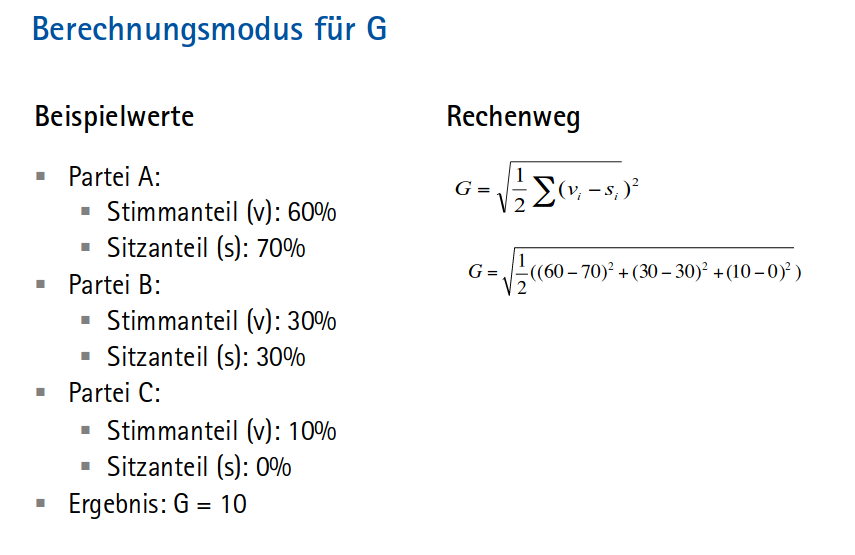

# II. Politische Kerninstitutionen im Regierungssystem
## Exekutive: Die Bundesregierung
### Wesentliche Ergebnisse
- das politische System der BRD ist typisch parlamentarisch, die Regierung wird durch das Parlament bestellt und entlassen 
- der Bundespräsident wird durch die Bundesversammlung gewählt 
  - er verfügt überwiegend zeremonielle Aufgaben, in Krisenzeiten bekommt er eine größere Rolle als „Reserverad“ 
- der Bundeskanzler wird mit absoluter Mehrheit gewählt und nur mit einem konstruktiven Mißtrauensvotum gestürzt
  - er ist wegen des Kanzlerprinzips die zentrale Figur in der Regierung 
- das Bundeskabinett arbeitet als kollektiv und hat eine wesentliche Rolle bei der Erstellung von Gesetzesentwürfen und Rechtsverordnungen 
- Bundesregierungen sind fast immer Minimalgewinnkoalitionen
  - die Entstehung lässt sich mit policy (Berücksichtigung von Distanzen pol. Ideologien) und office(rein ämterorientiert) - bezogenen Koalitionstheorien erklären 
- Bundesregierungen sind im internationalen Vergleich eher stabil 
- Bundesminister sind für ihre Ressorts verantwortlich 
  - die Ressortverteilung in der Koalition erfolgt entsprechend Gamson‘s Law (Kabinettsanteil einer Regierungspartei ist so hoch wie ihr Sitzanteil im Parlament)

### Mögliche Klausurfragen
1. Wie ist das Verhältnis von Bundestag, Bundeskanzler und Bundespräsident hinsichtlich Ernennung und Entlassung geregelt?
  - Bundestag wählt auf Vorschlag von Bundespräsident den BK
  - Bundestag kann BK durch konstruktives Mißtrauensvotum absetzen lassen, indem der Bundespräsident ihn auf Ersuch des Bundestags entlässt
  - BK kann Vertrauensfrage stellen und den Bundestag durch den Bundespräsidenten auflösen, wenn sie nicht positiv beantwortet wird
  - BP wird von Bundesversammlung gewählt (bestehend aus Bundestagsmitgliedern & Mitglieder der Landesparlamente)
  - BP kann auf Antrag von mind. 1/4 des Bundestags oder einem Viertel der Stimmen des Bundesrates mit einer 2/3 Mehrheit im Bundestag oder Bundesrat beim Bundesverfassungsgericht angeklagt werden und infolge dessen von seinem Amt enthoben werden
2. Welches sind die drei Prinzipien der Exekutivorganisation?
  - **to be added**
3. Was sind 4 Aufgaben des Bundespräsidenten?
  - Repräsentation & Integration
  - Vorschlagen eines Kanzlerkandidatens
  - Ernennung/Entlassung von Ministern
  - Ausfertigung von Gesetzen & rechtliche Prüfung
  - Auflösung des Parlaments (nur in Krisenzeiten)
  - Erklärung des Gesetzgebungsnotstand (nur in Krisenzeiten)

4. Was sind 4 Aufgaben des Bundeskanzlers?
  - schlägt Minister vor und "lässt" sie durch BP ernennen/entlassen
  - hat Organisationsgewalt über Geschäftsbereiche der Regierung
  - pol. Richtlinienkompetenz
  - Befehls- und Kommandogewalt im Verteidigungsfall
5. Was unterscheidet Rechtsverordnungen von Gesetzen?
  - Rechtsverordnungen sind sekundäres Rechts (also untergesetzlich), müssen tlw. Zustimmung vom BT/ BR erhalten
  - mit Rechtsverordnungen werden durch die Exekutive die Inhalte von Gesetzen (d. Legislative) spezifiziert
  - Gesetze können Bundesregierung, Bundesminister o. Landesregierungen ermächtigen Rechtsverordnungen zu erlassen

## Legislative: Bundestag und Bundesrat
### Wesentliche Ergebnisse
- der Abgeordnete steht im Spannungsverhältnis zwischen Wahlkreis und Bundestag sowie persönlicher Freiheit und Fraktion 
  - Parteienartikel (Artikel 20 I GG): Parteien wirken an der pol. Willensbildung des Volkes mit
  - Freies Mandat (Artikel 38 I GG): Abgeordnete sind Vertreter des ganzen Volkes, an Aufträge und Weisungen nicht gebunden und nur ihrem Gewissen unterworfen
- der Bundestag ist ein Parlament mit starken Fraktionen, die Bundesregierung kann die Tagesordnung des Bundestages nur bedingt beeinflussen 
- Ausschüsse spiegeln im Wesentlichen die Ministerien wider; Hilfsdienste arbeiten den Abgeordneten zu 
  - beides dient zum Ressourcenausgleich gegenüber der Regierung 
- der Bundestag hat vier Funktionen: Wahl, Artikulation, Kontrolle, Gesetzgebung 
  - der Bundestag ist ein Arbeitsparlament mit starken Ausschüssen und schwachem Plenum 
  - Kontrolle erfolgt durch die Opposition im parlamentarischen System
  - der Gesetzgebungsprozess ist mehrstufig; die überwiegende Zahl der (erfolgreichen) Entwürfe wird durch die Regierung eingebracht 

### Mögliche Klausurfragen
1. Was sind 5 Kontrollinstrumente der Opposition im Bundestag?
  - Politische Kontrolle, Effizienzkontrolle, Rechtskontrolle
  - Konstruktives Misstrauensvotum gegen BK
  - Parlamentarische Untersuchungsausschüsse (25% der BT-Mitglieder)
  - Große Anfragen (5% der BT-Mitglieder)
  - Kleine Anfragen (5% der BT-Mitglieder)
  - aktuelle Stunden
  - Fragestunde
  - indirekt: Bundesrat / Bundesländer
2. Was sind 4 grundlegende Funktionen des Bundestages?
  - Wahl
    - Bundeskanzler (2/3-Mehrheit), Bundespräsident (nur Mitglieder d. Bundesversammlung), Bundesverfassungsrichter (nur die Hälfte, 2/3-Mehrheit), Mitglieder des Vermittlungsauschusses (nur die Hälfte, Parteienproporz), Präsident und Vize des Bundesrechnungshof
  - Artikulation 
    - Artikulation von Wahlkreisinteressen und Gruppeninteressen im Spannungsfeld von:
      - Arbeitsparlament vs Redeparlament
      - Darstellungspolitik vs Sachverhalte
  - Kontrolle
    - Dualismus von Regierung(geht aus Parlamentsmehrheit hervor) und Opposition 
    - Opposition kontrolliert Regierung und artikuliert Kritik (ist Regierung im Wartestand / Schattenkabinett und eigene alternative Gesetzesentwürfe)
    - v.a. durch Opposition: Politische Kontrolle, Effizienzkontrolle, Rechtskontrolle
  - Gesetzgebung (legislative Funktion)
    - Einspruchsgesetzgebung (Einspruch des Bundesrates kann von gleicher Mehrheit im BT zurückgewiesen werden)
    - Zustimmungsbedürftige Gesetzgebung (für Gesetze an denen Länder beteiligt sind)
      - verweigerte Zustimmung des Bundesrates kann nicht zurückgewiesen werden
      - Blockade durch Opposition möglich, wenn sie Mehrheit im Bundesrat hat
    - Gesetzesinitiave geht hauptsächlich von der Ministerialbürokratie(Regierung) aus (BT & BR nehmen lediglich Veränderungen vor)
    - Vermittlungsauschuss wird (meist vom BR) angerufen wenn es zu keiner Einigung kommt
3. Wie lautet die Formel des Rice-Index und was lässt sich mit ihm berechnen?
  - die Geschlossenheit des Abstimmungsverhaltens (Standardindex zur Messung von Fraktionskohäsion)
  -  Ri = | JaStimmen in %  -  NeinStimmen in %| *oder* Betrag von JaStimmen minus NeinStimmen geteilt durch die Stimmanzahl
    - es geht um **Stimmen (innerhalb) einer Fraktion** (namentliche Abstimmung ist Voraussetzung)
  - typischer Rice-Wert in Deutschland 98 bis 99 -> Fraktionen kohäsiv
4. Welche Grundtypen an Ausschüssen kennt der Bundestag und was sind ihre Aufgaben?
  - Ständige Bundesausschüsse
    - bearbeiten substantiell inhaltich die Gesetzesentwürfe
    - Bildung von Expertise als Gegengewicht zur Regierungssystem
    - keine öffentliche Beratung
  - Enquete-Ausschüsse
    - Beratung von allgemeinen Themen mit konkretem Auftrag (Thinktanks/Denkfabrik)
    - für eine Legislaturperiode eingesetzt
    - zur Hälfte Experten, zur Hälfte Abgeordnete
  - Untersuchungsausschüsse
    - Aufarbeitung von pol. Problemfällen
    - "Kampinstrument" der Opposition -> hält Themen medial am köcheln
    - Besetzungsproporz wie im Bundestag (keine Oppositionsmehrheit!)

## Föderalismus: Länder und Kommunen
### Wesentliche Ergebnisse
- Föderalismus = ein Staat, in dem staatliche Macht (Souveränität) auf mind. 2 Ebenen verteilt ist
- der deutsche Föderalismus ist symmetrisch, kooperativ und exekutivenzentriert 
  - symmetrisch = alle Gliedstaaten haben gleiche Rechte
  - kooperativ = Bundes- und Landesebene kooperieren eng (Länder für Implementation von Gesetzen zuständig)
  - Exekutivföderalismus = föderale Zusammenarbeit wird durch die Exekutiven in Bund & Land durchgeführt
  - unitarischer Bundesstaat = starke Verflechtung bei Gesetzgebung, Finanzierung & Durchführung zur Herstellung einheitlicher Lebensverhältnisse
- er ist das Ergebnis der historischen Kleinstaaterei in deutschem Sprachraum 
- der Bundesrat vertritt die Exekutiven der Länder und wirkt über Einspruchs- und zustimmungsbedürftige Gesetzgebungsverfahren mit  
- die Opposition kann – wenn sie dort über eine Mehrheit verfügt und es sich um ein zustimmungspflichtiges Verfahren handelt – den Bundesrat als Blockadeinstrument nutzen
  - eine Drohung mit einem Veto erzeugt auch autonom Wirkung (Autolimitation) 
    - antizipative Effekte, die Blockaden vermeiden sollen
    - Regierung beschränkt sich selbst und versucht Position der Opposition (wenn diese Bundesrat kontrolliert), zu antizipieren (Autolimitation = Selbstbeschränkung)
      - Einfluss des Bundesrats tatsächlich größer als es es scheint

### Mögliche Klausurfragen
1. Aus welchen Gründen entstehen föderale Systeme?
  - Coming together These
    - Aushandlungsprozess kleinerer Staaten zur Konzentration(Fusion)
    - zB. Deutschland, EU, Schweiz
  - Holding together These
    - auseinander strebende Teile eines Einheitsstaates sollen durch föderale Arrangements zusammengehalten werden
    - zB. Spanien, Belgien, Schweiz
2. Aus welchen Gründen treten zweite Kammern auf?
  - historische Gründe der Repräsentation unterschiedlicher Gesellschaftsschichten(Stände) oder Territorien
  - im Zuge d. Demokratisierung wurden die ehem., meist den Adel repräsentierenden, Kammern um eine weitere "demokratische" Kammer ergänzt
    - in einigen Fällen kam es auch zur Demokratisierung der bestehenden Kammer
  - zweite Kammern finden sich immer in föderalen Systemen zur Repräsentation der Gliedstaaten (zB Deutschland)
  - Symmetrie = beide Kammern sind gleichberechtigt -> zweite Kammer hat Veto
  - Asymmetrie = eine Kammer kann die andere überstimmen -> zweite Kammer hat nur suspensives Veto
  - Kongruenz = beide Kammern werden gleichermaßen zusammengesetzt
  - Inkongruenz = unterschiedliche Zusammensetzung
  - im Fall Deutschland: Starker Bikameralismus (Inkongruenz & Symmetrie) wenn es um zustimmungsbedürftige Gesetze geht und schwacher Bikameralismus (Inkongruenz & Asymmetrie) wenn es um Einspruchsgesetzgebung geht (keine Blockade durch Opposition im Bundesrat moeglich da Bundestag überstimmen/zurückweisen kann)
    - die meisten Gesetze werden von Ländern ausgeführt, dies macht sie zustimmungspflichtig im Bundesrat
    - Formal ist der Bundesrat keine zweite Kammer, wird jedoch als solche wahrgenommen
3. Welche Stimmanteile werden für die Wahlfunktionen des Bundesrates benötigt?
  - Wahl der Hälfte der Bundesverfassungsrichter(2/3-Mehrheit)
  - Wahl der Richter an anderen obersten Gerichten (50% Richterwahlausschuss)
  - Mitwirkung bei Generalbundesanwalt, Präsidenten d. Landeszentralbanken etc.
  - 1/3-Mitwirkung im Notstandsparlament (gemeinsamer Ausschuss), Artikel 53a
  - Mitentscheidung beim Gesetzgebungsnotstand, Artikel 81GG
  - Anrufungsrecht Bundesverfassungsgericht bei Organstreit, Präsidentenanklage sowie Parteienverbot

## Judikative: Das Bundesverfassungsgericht und das Gerichtssystem
### Wesentliche Ergebnisse
- das Bundesverfassungsgericht ist wegen der erforderlichen 2/3-Mehrheit in Bundestag und Bundesrat eher konsensual(einvernehmlich) besetzt
- es verfügt über ein breites Spektrum an Verfahrensarten
- Verfassungsgerichte können Gesetze annullieren
  - die Drohung der Annullierung erzeugt bereits Wirkung auf Parlament & Regierung (Autolimitation)

### Mögliche Klausurfragen
1. Welche Aussagen lassen sich zu den Verfahrensarten des Bundesverfassungsgerichtes machen?
  1. Organstreitigkeiten
    - Umfang & Kompetenzen von obersten Bundesorganen 
    - Klage mögl. von: Abgeordneten, Parteien, Fraktionen, Bundesregierungsmitgliedern
  2. Abstrakte Normenkontrolle
    - Unvereinbarkeit mit höherrangigem Recht
    - alle Rechtsnormen, auch vorkonstitutionell
    - Klage mögl. von: Bundesregierung, Landesregierung, 1/3 Bundestag(bis 2009) 1/4 Bundestag(seit 2009)
  3. Konkrete Normenkontrolle
    - aktueller Fall vor Gericht nicht vereinbar mit Verfassung aus Sicht des verhandelnen Gerichtes
    - formelle nachkonstituionelle Gesetze
    - Verweis durch niedrigeres Gericht an das Bundesverfassungsgericht
  4. Bund-Länder-Streitigkeiten
    - Rechte und Pflichten von Bund und Land und Länderstreite
    - quantitativ selten, aber qualitativ von Bedeutung
  5. Verfassungsbeschwerde
    - individuelle Grundrechtsverletzung
    - Klage mögl. von: jedermann, inländische juristische Personen
    - hohe Fallzahlen
  6. Sonstiges
    - Parteienverbot, Grundrechtsverwirkung, Bundespräsidentenanklage, Richteranklage, Wahlprüfung, Mandatsverlust
2. Welche Aussagen lassen sich zu den Eigenschaften des Bundesverfassungsgerichtes?
  - Zwillingsgericht bestehend aus 2 Senaten a 8 Richter
    - 1. Senat = Grundrechtsschutz
    - 2. Senat = abstrakte Normenkontrollen, Bund-Länder-Streitigkeiten, Verfassungsbeschwerden bei ÖD, Strafrecht, Ausländerrecht
    - 6 Kammern
3. Wie ist das Phänomen der Autolimitation / Justizialisierung zu erklären?
  - seit 90er Fokus auf Justizialisierung
  - Justizialisierung bedeutet, dass pol. Entscheidungen immer stärker durch rechtliche Erwägungen durchdrungen werden
  - Regierung und Parlament passen sich nach Einführung eines Verfassungsgerichtes dessen (vermuteter) Position an, da das Gericht ein Gesetz beanstanden kann
4. Wie verläuft die Urteilsfindung im Bundesverfassungsgericht?
  - verschiedene Varianten von Entscheidungen
    - zB vollständig verfassungswidrig, tlw. verfassungswidrig, verfassungskonform etc.
  - Entscheidungsfindung im Senat
    - Annahme von Anträgen bei min. 5:3
    - Zurückweisung bei 4:4 oder 3:5
    - abweichende Meinungen sind möglich
    - keine Veröffentlichung des individuellen Abstimmungsergebnisses
  - Kammerentscheidungen (Beschlüsse)
    - nur einstimmig
    - nur bei zuvor dem Grunde nach entschiedenen Gegenständen
    - nur bei Verfassungsbeschwerden
5. Welche Eigenschaften hat die Richterwahl?
  - mind. 40 Jahre
  - zweites juristisches Staatsexamen abgeschlossen
  - 3/8 in jedem Senat ehem. oberste Bundesrichter
  - Amtszeit: 12 Jahre
  - keine Wiederwahl
  - keine Entlassung durch Wahlinstitutionen möglich
  - Formelles Auswahlverfahren:
    - Auswahl nach Proporz-Verfahren
    - 50% Bundestag in beiden Senaten mit 2/3-Mehrheit
      - Bundestag stimmt mit 12-köpfigem Ausschuss mit Proporz ab
        - Vertraulichkeit der Beratungen
        - keine Veröffentlichung der Ergebnisse
    - 50% Bundesrat in beiden Senaten mit 2/3-Mehrheit
      - Länderkammer stimmt im Plenum ab
    - Plenum des BVerG darf Dreierliste vorlegen
  - Informelles Auswahlverfahren:
    - BT-Ausschuss ist nur der formale Rahmen
    - Findungskommission im BT aus Regierung & Opposition und im BR Landesjustizminister
    - zwang zur Absprache durch 2/3-Mehrheit
    - Vorschlagsrecht im Wechsel SPD und CDU/CSU
    - drei von vier "eigenen" Richtern gehören der Partei an, der andere steht ihr nahe
    - Einbeziehung des kleineren Koalitionspartners im ersten Senat

## Verwaltung: Bundes -, Landes- und Kommunalverwaltung
### Wesentliche Ergebnisse
- der Prinzipal-Agent-Ansatz eignet sich zur Analyse von Beziehungen zwischen Politik und Verwaltung
- die Bundesministerien implementieren nur einen kleinen Teil der Politik in Deutschland 
- Kommunen nehmen auf unterschiedlichen Ebenen eigene und übertragene staatliche Aufgaben wahr 
- die Kommunalverfassungen haben sich in den 1990er Jahren im wesentlichen der süddeutschen Bürgermeisterverfassung angepasst 
  - die Direktwahl des Bürgermeisters als Leiter der Verwaltung wurde flächendeckend eingeführt 

### Mögliche Klausurfragen
1. Was sind die 5 Typen der Fachgerichtsbarkeit in Deutschland?
  - Ordentliche Gerichte
  - Sozialgerichte
  - Arbeitsgerichte
  - Finanzgerichte
  - Verwaltungsgericht
2. Welche Aussagen lassen sich zur süddeutschen (und anderen) Bürgermeisterverfassungen machen?
  - Süddeutsche Bürgermeisterverfassung
    - direkt gewählter Bürgermeister, welcher Rat & Verwaltung leitet (längere Amtszeit als Rat)
  - Dualistische Bürgermeisterverfassung
    - Direktwahl v. Bürgermeister, Leitung des Rates durch Ratsmitglied
  - Ratsverfassung mit volksgewähltem Bürgermeister
    - starke Stellung des Rates bei Direktwahl v. Bürgermeister
  - Unechte Magistratsverfassung mit volksgewähltem Bürgermeister
    - Direktwahl Bürgermeister, der Verwaltung im Kollegium/Magistrat leitet
  - Norddeutsche Ratsverfassung
    - Bürgermeister wird vom Rat gewählt, hat selbe Amtszeit und leitet nur den Rat (Verwaltung wird vom Gemeindedirektor geleitet)
  - Unechte Magistratsverfassung
    - hauptamtlich direkt gewählter Bürgermeister mit tlw. eherenamtlichen Beigeordneten, strikte Trennung von Rat und Bürgermeister/Magistrat
  - Rheinische Bürgermeisterverfassung
    - analog zum süddeutschen Modell, aber Wahl des Bürgermeisters durch Rat
3. Wie lautet die Funktionsweise des Prinzipal-Agent-Ansatzes?
  - Prinzipal (Auftragsgeber) delegiert eine Aufgabe an einen Agenten (Auftragnehmer)
  - der Agent soll den Auftrag für eine Gegenleistung ausführen und ist dem Auftraggeber ggü. verantwortlich
  - Probleme: 
    - Ziel/Präferenzen des Auftragnehmers weichen vom Auftragsgeber ab
      - Agency Loss = Agent integriert seine eigenen Vorstellungen und setzt Ziele des Prinzipals nicht vollständig um
      - Adverse Selection = bestimmte Eigenschaften/Einstellungen des Agenten sind dem Prinzipal nicht bekannt
    - Informationsasymmetrie
      - Moral Hazard: Agent kann Handlungen durchführen, die dem Prinzipal verborgen bleiben
    - keine vollständige Überwachung des Agenten mögl. (erhöhte Transaktionskosten)
      - Transaktionskosten = Kosten für Vertragsschließung + Überwachung
  - Überwachungsmechanismen des Prinzipal
    - ex-ante: Auswahl des Agenten
    - ex-post: Kontrolle des Agenten (fire alarm = Kontrolle nach Alarmmeldung, police patrol = regelmäßige Kontrolle)
4. Was sind 4 kommunale Einnahmequellen?
  - Steuereinnahmen (Gewerbesteuer, Einkommenssteueranteil, Umsatzsteueranteil, Grundsteuer)
  - Gebühren / Beiträge
  - laufende Zuweisungen / kommunaler Finanzausgleich
  - Investitionszuweisungen

# III. Politische Akteure und Prozesse
## Wahlrecht, Wahlsystem und Wahlverhalten
### Wesentliche Ergebnisse
- das Wahlsystem der Bundesrepublik ist ein kompensatorisches gemischtes Wahlsystem mit einem immer stärkeren Trend zur Proportionalisierung 
  - kompensatorische gemischte Wahlsystemtypen (abhängige) = 
  - Verhältniswahl weist hohe Proportionalisierung bei der Übersetzung von Stimmen in Mandate auf (erzeugt mehr Parteien)
- es handelt sich um ein personalisiertes Verhältniswahlsystem mit starren Listen, 5% Sperrhürde, Grundmandatsklausel, Reststimmenverrechnung nach St.  Lague , Überhangmandate werden durch Ausgleichsmandate kompensiert
  - personalisierte Verhältniswahl (D)
    - BRD ist in 299 Wahlkreise eingeteilt
    - Erststimme = Wahl eines Direktkandidaten; 299 Einerwahlkreise
      - Wahl nach relativer Mehrheitswahl
    - Zweitstimme = Parteipräferenz (Mandatsverteilung) auf einer starren Parteiliste; 299 Proporzabgeordnete
      - Wahl erfolgt über Verhältniswahl
      - zentrale Grundlage für Mandatsvergabe
      - Listenmandate stellen sicher, dass die Gesamtzahl der Sitze einer Partei proportional zu ihrem landesweitem Stimmenanteil ist (*kompensatorisches* System)
    - Bundestagsgröße = 299 + 299 = 598 + Überhangmandate + Ausgleichsmandate
  - Wahlhürde = 5% Sperrklausel mit Grundmandatsklausel
    - Bezugsgröße = 5% der abgegebenen Stimmen im Bundesgebiet
    - erreicht eine Partei 5%(Fraktionsstatus) **oder** 3 Direktmandate(Gruppenstatus) zieht sie analog zur Stimmenstärke in BT ein 
    - direkt gewonnene Mandate erhält sie unabhängig vom Einzug
  - Wahlformel = Saint-Laguë seit 2009 
  - Kandidatenwahl = starre Listen auf Landesebene
  - Verrechnungsebene = Gesamt BRD, Überhang- sowie Ausgleichsmandate möglich
  - Fazit -> kompensatorisches System, kein Grabensystem
- das Wahlverhalten wird durch Beruf, Einkommen, Bildungsstand, Religion sowie Migrationshintergrund bestimmt
  - darüberhinaus spielen demographische Faktoren eine Rolle
  - Wahlbeteiligung in neuen Bdsl. durchschn. niedriger
  - Veriablen im Wahlverhalten = strateg. Wählen, soziale Schicht & Parteipräferenz, Konfession und Parteipräferenz, demographische Faktoren
- Stimmenauszählung und -verrechnung
Doppeltes Verrechnungsverfahren 
  - Schritt 1: Anzahl der einer Partei zustehenden Mandate wird für das gesamte Bundesgebiet auf Basis der Zweitstimmen berechnet (nach Saint-Laguë) 
  - Schritt 2: Anzahl der einer Partei zustehenden Mandate wird für alle Bundesländer berechnet (nach Saint-Laguë) 
  - Schritt 3: Anrechnung der Direktmandate auf das Zweitstimmenergebnis. Abarbeitung der Landeslisten. Ggf.  Identifikation von Überhangmandaten 
    - Überhangmandate entstehen wenn eine Partei mehr Mandate über Direktwahl gewinnt, als ihr rechnerisch entsprechend der Grundverteilung zustehen würde
      - insbsd. dann wenn eine Partei viele Direktmandate in einem Mehrparteiensystem gewinnt
      - führt zu Disproportionalität deshalb Ausgleichsmandate
  - Schritt 4 (neu): Ausgleich der Überhangmandate 

### Mögliche Klausurfragen
1. Welche Elemente charakterisieren das deutsche Wahlsystem hisnchtlich Wahlhürde , Kandidatenauswahl, Wahlsystem und Reststimmenverrechnung? 
  - siehe oben
2. Was berechnet der Gallagher-Index und wie lautet die Formel?
  - Index für die Disproportionalität eines Wahlsystems ist der *Gallagher-Index* G
  - die Disproportionalität für Partei i ist die Differenz zw. ihrem Anteil an Wählerstimmen (v) und ihrem Anteil an Mandaten(s)
  - diese Differenzen werden quadriert, um große Abweichungen stärker zu gewichten, und dann summiert

## Politische Parteien und Parteiensystem
### Wesentliche Ergebnisse
- das Cleavage-Konzept geht von vier klassischen Hauptcleavages aus sowie einem neuen 
  - Ziel: makrosoziologische Erklärung der Unterschiede in pol. Systemen
  - funktionale Cleavages wichtiger als territoriale
  - der neue Cleavage befindet sich zwischen Materialismus und Postmaterialismus
- die effektive Parteienzahl kann mit der ENP Kennzahl ermittelt werden
- das Parteiensystem in Deutschland hat sich in 5 Phasen entwickelt
  - Phase 1: Kontinuität und Neubeginn 1945-1951
  - Phase 2: Konzentration des Parteienystems 1952-1961
    - hauptsächlich CDU/CSU, FDP und SPD
  - Phase 3: Das Zweieinhalb-Parteiensystem 1961-1983
    - CDU/CSU, FDP und SPD
  - Phase 4: Das Zwei-Parteigruppensystem 1983-2006
    - im Westen: CDU/FDP vs SPD/Grüne
    - im Osten: CDU, SPD und PDS
    - im Bund: Erhaltung beider volksparteilicher Pole
  - Phase 5: Weiterentwicklung zum nationalen 5/6-Parteiensystem 2006-heute(?)
    - Stabilisierung der Linken auch im Westen
    - geringere Sitzanteile der großen Parteien zwingen zu neuen Koalitionen
- Kenntnis der Sartori-Klassifikation zu Parteiensystemen 
  - Typologie mit zwei Dimensionen:
    - Anzahl der Parteien
    - ideolog. Distanz zw. Parteien
  - die zwei Dimensionen werden nicht unabhängig gedacht, denn die Anzahl der Parteien beeinflusst die ideologische Polarisierung und ist der Hauptgrund, warum die Anzahl überhaupt relevant ist
- Kenntnis der grundlegenden Theorien und Regeln zu Interessengruppenwettbewerb 
- Kenntnis grundlegender Funktionen von Parteien
  - Rekrutierungsfunktion, Programmfunktion, Meinungsbildungsfunktion, Einflussnahmefunktion
 
### Mögliche Klausurfragen
1. Welche Opfer der 5% Sperrklausel gab es seit 1983 von Parteien, die zuvor im Bundestag vertreten waren? 
  - FDP 2013
  - PDS 2002
  - (West-)Grüne/B90 1990
2. Ordnen Sie den Entwicklungsphasen des deutschen Parteiensystems die jeweiligen Parteien und Zeiträume zu
  - siehe oben
3. Was sind die 4 klassischen Cleavages nach Lipset/Rokkan?
  - Zentrum / Peripherie (entstanden aus nationalen Revolutionen)
  - Kirche / Staat (entstanden aus nationalen Revolutionen)
  - Stadt / Land (entstanden aus industriellen Revolutionen)
  - Kapitaleigentümer / Land (entstanden aus industriellen Revolutionen)
4. Wie berechnet sich die ENP und was ist ihre Zielsetzung
  - empirische Messung der Zahl der Parteien mit dem Indikator "effectie number of parties"(ENP)
    - nicht nur Zahl der Parteien alleine, sondern auch deren relative Größe ist relevant

  - **wichtig:** bei ungleichen Gewichten ist die ENP **kleiner** als die tatsächliche Anzahl v. Parteien
  
## Interessengruppen und Eliten
### Wesentliche Ergebnisse
- Rolle von Verbänden
  - Artikulation & Bündelung von Interessen, die eher partikularisch und im Gegensatz zu Parteien keinen umfassenden Anspruch haben
  - intermediäre Institutionen im pol. System
- grundlegende Theorien zu Interessengruppenwettbewerb
  - Logik des kollektiven Handelns (Mancur Olson, 1965)
    - konzentrierte Interessen unterscheiden sich von diffusen Interessen in der Organisationsfähigkeit => kleine Gruppen können sich leichter organisieren als größere Gruppen
    - exklusive Interessen sind leichter zu organisieren als kollektive Interessen (CBDC =  Concentrated Benefits - Deconcentrated Costs)
- Regeln zur Interessengruppenbeteiligung(Verbandsbeteiligung) in Deutschland
  - Deutschland gehört laut Meta-Index von Siaroff eher zu korporatistischen Ländern
    - starke Vertretung von Interessen im BT durch Mitgliedschaft der BT-Abgeordneten (ca. 1/3 Gewerkschaftsmitglieder)
  - Einfluss im vorparlamentarischen Prozess
  - gemeinsame Geschäftsordnung der Bundesministerien (GGOBM)
    - Beteiligung von Ländern, kommunalen Spitzenverbänden, Fachkreisen und Verbänden bleibt, soweit keine Sondervorschriften bestehen, dem Ermessen des federführenden Bundesministeriums überlassen
    - für Gesetzesentwurf zuständige Bundesministerien haben Angaben zu den beteiligten Fachkreisen & Verbänden zu machen
  - Zugang zu Parlamentariern & Parteien während des Gesetzgebungsprozesses
    - im parlamentarischen Prozess indirekter Einfluss über Verbandsmitgliedschaft von Abgeordneten
    - Anhörung von Experten und Beteiligten in der Ausschussphase des Parlaments
- Grundcharakteristika von deutschen Eliten
  - Wertorientierungen
    - insgesamt sehr pro-demokratisch eingestellt
    - säkulare Wertvorstellungen der Eliten (Ausnahme: CDU-affine Eliten)
    - 49% der Eliten sind postmaterialistisch, 28% gemischt postmaterialistisch-materialistisch
    - Eliten sind liberaler als angenommen
  - Parteinähe
    - Parteinäh & Parteimitgliedschaft nehmen zu
    - 51,4% der nicht-politischen Eliten sind Parteimitglied
    - mit Ausnahme von Gewerkschaften sind Eliten eher konservativ und bevorzugen CDU und FDP

### Mögliche Klausurfragen
1. Wie lautet die Definition von Pluralismus und Korporatismus ?
  - Pluralismus (Bentley 1908, Truman 1951)
    - innerhalb einer Gesellschaft eines Staates vorhanden
    - ist die Vielfalt der nebeneinander bestehenden und miteinander um Einfluss & Macht konkurrierender Gruppen/Organisationen/Institutionen
    - keine staatliche Intervention
  - Korporatismus (Schmitter 1974)
    - ist auf Arbeit-Kapital Beziehungen beschränkt
    - System der Interessenvermittlung zw. Staat und Interessengruppen
      - Staat delegiert Aufgaben an einzelne Interessengruppen
      - Interessenvermittlung ist durch Aushandlungsprozesse geprägt
    - begrenzte Zahl an Verbänden und Zwangsmitgliedschaft
    - Entscheidungsprozesse sind außerparlamentarisch institutionalisiert
2. Welche gängigen Interessenverbände gibt es?    
  - vier einflussreiche Hauptgruppen:
  - Arbeitgeber
    - BDA (Bundesvereinigung der Deutschen Arbeitgeberverbände) vertritt Arbeitgeber in sozialpol. Hinsicht
    - BDI (Bundesverband der Deutschen Industrie) vertritt 90% der Arbeitgeber der Industrie
    - DIHK (Deutscher Industrie- und Handelskammertag) vertritt v.a. gewerbliche Wirtschaft, ist aber halbstaatlich (Zwangsmitgliedschaft)
  - Arbeitnehmer, Gewerkschaften
    - DGB (Deutscher Gewerkschaftsbund) bestehend aus 8 Einzelgewerkschaften (größte Einzelgewerkschaft: IG Metall)
    - DBB (Beamtenbund und Tarifunion)
    - CGB (Christlicher Gewerkschaftsbund)
  - Kirchen
    - Säkularisierung und Wertewandel führt zu Mitgliederverlurst
    - CDU affinzer zur kath. Kirche, SPD zur evang. Kirche
    - Finanzierung durch Kirchensteuer
  - Deutscher Bauernverband (DB)
    - rasanter Strukturwandel durch Schrumpfen des ersten Sektors
    - Einflussverlust durch Stärkung von Verbraucherschutz
3. Welche Typen von Eliten gibt es?
  - Politische Eliten
    - Mitglieder d. Bundes- und Landesregierungen
    - leitende Mitglieder des Bundestages
    - Partei- und Fraktionsspitzen
    - Spitzen in der EU und in den Kommunen
    - **nicht** alle BT- und LT-Abgeordneten
  - Verwaltungs- und Justizelite
  - wirtschaftl. Eliten
  - kirchliche Eliten
  - militärische Eliten
  - wissenschaftliche Eliten
4. Woraus setzen sich Eliten zusammen(Rekrutierung)?
  - Kontinuität nach Systemumbrüchen
    - nach Weimar blieben die alten Eliten an der Macht, nach 1945 wurden die pol. Eliten getauscht, nicht aber die Eliten in Wirtschaft, Justiz und Verwaltung
    - nach 1990 Entmachtung der alten ostdeutschen Eliten
    - Frauenanteil unter pol. Eliten steigend
  - soziale Herkunft
    - insgesamt eher aus Mittel- und Oberschicht
    - soziale Differenzen zw. Eliten & Bevölkerung nehmen ab
    - *aber* starke Differenzen zw. Sektoren
      - FDP zb. 42.6% der Elite aus Oberschicht, obwohl nur 6.2% der Bevölkerung Oberschicht ist
    - insgesamt deutlich bessere Durchlässigkeit in Politik als in Wirtschaft
    - Professionalisierung pol. Eliten
      - Zunahme der Professionalisierung d. pol. Elite (Berufspolitiker)
      - *aber:* mit wenigen Ausnahmen altern pol. Eliten schnell und befinden sich in einer instablien, "prekären" Situation

## Grundgesetzänderungen und Staatsfinanzen
### Wesentliche Ergebnisse
- die wesentlichen Einkommensarten sind Steuern und Sozialabgaben, davon insbesondere die Gemeinschaftssteuern:
  - Einkommenssteuer, Körperschaftssteuer und Umsatzsteuer
  - Einnahmeseite(2004) 46.4% Steuern, 38.1% Sozialabgaben
- Ausgaben werden zu >50% für Sozialpolitik getätigt
- Staatsquote (Anteil des Staates am BIP) betrug 2005 46.8%, was im internationalen Vergleich mittelhoch ist (Schweden 57.2%, USA 34%)
  - aber Bildungsausgaben sind auf den untersten Plätzen in der OECD-Skala

- Finanzverfassung ist föderal und die Einheiten sind unabhängig voneinander
  - es gibt kein nationales Budget im engeren Sinne
  - Bund und Länder in Haushaltsführung prinzipiell unabhängig voneinander, müssen sich aber zur Sicherstellung des gemeinwirtschaftlichen Gleichgewichtes koordinieren
  - Schuldenbremse (2006 mit Föderalismusreform eingeführt, ab 2016 für Bund, 2020 für Länder)
    - *Einnahmen und Ausgaben sind grundsätzlich ohne Einnahmen aus Krediten auszugleichen*
- die Verfassung wird auf unterschiedlichen Skalen eher als rigide eingestuft, trotzdem ist die Änderungsrate eher hoch
  - 51 Änderungsgesetze, 246 Änderungen, 37 neue Artikel, Verdoppelung der Länge
    - sehr häufig Änderungen in Verfahren der Gesetzgebung
    - kaum Änderungen an der institutionellen Grobstruktur
    - Änderungen an Grundrechten mittel
  - neue Bereiche: Wiederbewaffnung, Notstandsverfassung, Finanzausgleich, Gemeinschaftsausgaben, Beziehungen zur EU
- aufgrund des identischen Parteiensystems in Bund & Ländern ist die Große Koalition ein Türöffner für Verfassungsänderungen
  - ansonsten große Oppositionspartei ohne Sperrminorität im BT & Mehrheit im BR **oder** Einvernehmen von Regierung & Opposition

### Mögliche Klausurfragen
1. Nennen Sie die drei Gemeinschaftssteuern. Nach welchem Schlüssel werden die drei Steuern auf Bund, Länder und Kommunen verteilt? Nach welchem Schlüssel wird der Länderanteil zwischen den Ländern verteilt? 

  - Gemeinschaftssteuern werden auf die einzelnen Ebenen nach Anteilen verteilt und sind die wesentlichen Einkommensquellen
    - Lohn/-Einkommenssteuer 42.5% Bund, 42.5% Länder, 15% Kommunen
    - Körperschaftssteuer 50% Bund, 50% Länder
    - Umsatzsteuer 53.2% Bund, 46.6% Länder, 2.2% Kommunen
  - die Anteile eines Landes am Einkommenssteueranteil der Länder bemisst sich nach örtlichem Aufkommen
  - die Anteile eines Landes am Körperschaftssteueranteil der Länder bemisst sich nach örtlichem Aufkommen
  - die Anteile eines Landes am Umsatzsteueranteil der Länder bemisst sich nach der Einwohnerzahl

2. Was sind zwei Beispiele für Bundes- und Landessteuern
  - Steuereinnahmen nach Trenn- und Verbundsystem
  - Bundesteuern:
    - Zölle, EU Steuern, KfZ Steuer, Kapitalverkehrsteuer
  - Landessteuern:
    - Vermögenssteuer, Erbschaftssteuer, Biersteuer, Spielbankenabgabe

3. Aus welchen drei Finanzquellen wird über die Verteilung der Gemeinschaftssteuern hinaus finanzschwachen Ländern geholfen? 
  - Sekundärer vertikaler Finanzausgleich: **Länderfinanzausgleich**
    - Umverteilung von reichen zu armen Ländern zum Ausgleich der Finanzkraft
    - Geberländer: Bayern, BaWü, Hessen
    - Nehmerländer: Berlin, Sachsen, NRW
  - Sekundärer horizontaler Finanzausgleich: **Bundesergänzungszuweisungen**
    - Förderung von finanzschwachen Ländern zur Deckung ihres allg. Finanzbedarfs
    - für Länder, deren Finanzkraft auch nach Länderfinanzausgleich noch zu 100% unter Länderdurchschnitt liegt
  - **Sonderbedarfs-Bundesergänzungszuweisungen**
    - Förderung von *besonders* finanzschwachen Ländern zur Deckung ihres allgemeinen Finanzbedarfs (Berlin, Bremen, Saarland)

4. Welche Regelungen gelten für das Grundgesetz hinsichtlich Änderungsraten, Änderungsverboten und richterlichen Kontrollen?
  - Mehrheitserfordernis Artikel 79 II
    - 2/3-Mehrheit im Bundestag und
    - 2/3-Mehrheit im Bundesrat
    - **aber:** Ewigkeitsklausel Art. 79 III
      - *"Eine Änderung dieses Grundgesetzes, durch welche die Gliederung des Bundes in Länder, die grundsätzliche Mitwirkung der Länder bei der Gesetzgebung oder die in den Artikeln 1 und 20 niedergelegten Grundsätze berührt werden, ist unzulässig"*
  - Verfassungsrigidität bezeichnet die Schwierigkeit, eine Verfassung zu ändern
