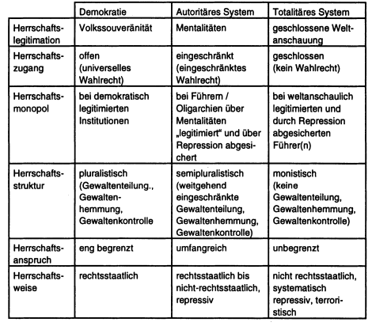

# 1. Typologie politischer Systeme
pol. System ist "funktional spezialisiertes" Teilsystem
- Aufgabe: das Überleben der Gesellschaft durch gesellschaftlich "verbindliche Allokation von Werten & Gütern" sichern
  - zu diesem Zweck: besondere staatl. Gewalt- und Sanktionsmittel
  - "Monopol legitimer phys. Gewaltsamkeit"
  - entsprechend ihrer Legitimation, bilden pol. Systeme bestimmte Strukturen & Mechanismen des Zugangs zu & der Sicherung von pol. Macht aus
    - die den pol. Systemen zugrunde liegenden Normen prägen den Herrschaftsanspruch & die Konfiguration der staatl. Herrschaftsinstitutionen

Staats- und Regierungsformen lassen sich nach bestimmten Merkmalen ihrer internen Herrschaftsorganisation klassifizieren
- zB Systematisierung von Aristoteles nach einem qualitativem (wie wird im Bezug auf das Allgemeinwohl geherrscht?) und einem quantitativem (wieviele herrschen?) Kriterium
  - daraus ergab sich Dreigliederung von Herrschaftsformen:
    - *Alleinherrschaft*
      - gut: Monarchie | entartet: Tyrannis
    - *Herrschaft der Wenigen*
      - gut: Aristokratie | entartet: Oligarchie
    - *Herrschaft der Vielen*
      - gut: Politie | entartet: Demokratie
- zB Reduktion der staatl. Erscheinungsformen von Machiavelli auf zwei Grundtypen:
  - Republik
  - Fürstentum
- zB Unterscheidung in drei Regierungsformen von Montesquieu:
  - Republik (in aristokratischer & demokratischer Form)
  - Monarchie
  - Despotie

nur bei genauer Definition & Abgrenzung der einzelnen Herrschaftstypen kann entschieden werden ob die Transformation eines politischen System ein wirklicher Systemwechsel ist

Merkel nimmt deduktive Einteilung der pol. Systeme vor
- Konstruierung von Idealtypen (angelehnt an Weber)
  - Bezug auf das Kriterium der "politischen Herrschaft"
- sechs Klassifikationskriterien im Verbund mit grundsätzlichen Fragen die sich ausschließlich auf die Herrschaft in einem pol. Sys. beziehen
  - Herrschaftslegitimation
    - Wie & in welchem Umfang ist Herrschaft legitimiert? Legitimation über bestimmte Mentalitäten wie Nationalismus, Partiotismus oder durch geschlossene Weltanschauungen mit absolutem Wahrheitsanspruch?
  - Herrschaftszugang
    - Wie geregelt? Auswahl der Regierenden (uneingeschränktes Wahlrecht)?
  - Herrschaftsmonopol
    - Wer trifft pol. bindende Entscheidungen (allein demokr. legitimierte staatl. Instanzen oder auch weniger demokr. legitimierte Akteure wie Militär)
  - Herrschaftsstruktur
    - Ist staatl. Macht auf mehrere Herrschaftsträger verteilt oder in Hand eines Einzelnen (Gruppe, Person, Junta, Partei)? -> Gewaltenteilung, Gewaltenhemmung, Gewaltenkontrolle
  - Herrschaftsanspruch
    - Ist staatl. Herrschaftsanspruch ggü. Bürgern klar begrenzt oder tendentiell unbegrenzt? -> Frage nach Regelungs- und Interventionstiefe
  - Herrschaftsweise
    - Folgt Ausübunng staatl. Herrschaft rechtsstaatlichen Grundsätzen oder wird sie nicht-rechtsstaatlich, repressiv oder gar willkürlich/terroristisch asugeübt? -> Frage der verbindlichen Normierung staatl. Gewalt durch legitim gesetzte Normen

-> Nach diesen Kriterien lassen sich fast alle pol. Systeme drei Grundtypen zuordnen
- Demokratien
- autoritäte Systeme
- totalitäre Systeme

## 1.1 Demokratische Systeme
es muss ein offener Wettbewerb um pol. Ämter & Macht und gleichzeitig ausreichend Raum für pol. Partizipation aller Bürger gewährleistet sein

für die Gewährleistung des notwendigen Maßes an Verantwortlichkeit der Regierung ggü den Präferenzen gleicher Bürger müssen folgende drei Möglichkeiten offen bleiben:
- Möglichkeit Präferenzen zu formulieren
- Möglichkeit Präferenzen den Mitbürgern und der Regierung durch individuelles & kollektives Handeln zu verdeutlichen
- Präferenzen müssen von Regierung unabhängig ihrers Inhalts/Herkunft gleichermaßen gewichtet werden

-> notwendige (aber nicht hinreichende) Bedingungen

acht institutionelle Garantien:
- Assoziations- und Koalitionsfreiheit
- Recht auf freie Meinungsäußerung
- Recht, zu wählen (aktives Wahlrecht)
- Recht, in öffentliche Ämter gewählt zu werden (passives Wahlrecht)
- Recht politischer Eliten, um Wählerstimmen und Unterstützung zu konkurrieren
- Existenz alternativer, pluralistischer Informationsquellen (Informationsfreiheit) 
- Freie und faire Wahlen
- Institutionen, die die Regierungspolitik von Wählerstimmen und anderen Ausdrucksformen der Bürgerpräferenzen abhängig machen

-> die von Locke erstmals thematisierte und von Montesquieu ausdifferenzierte Gewlatenteilung wird aus Dahls Minimalkriterien nicht explizit deutlich sondern ist nur implizit in Punkt 8 aufgehoben
- tatsächlich sind die Grenzen zwischen Legislative & Exekutive in den meisten heutigen Demokratien verwischt

Trennlinie zu den autokratischen Systemen kann jedoch mit Hilfe der von Merkel genannten sechs Differenzierungskriterien und anhand von Dahls acht institutionellen Minimalgarantien bis auf wenige ,,Mischsysteme" deutlich gezogen werden
- nur wenn diese gewährleistet sind, erfüllen politische Systeme ein generelles Merkmal von Demokratien
  - die prinzipielle Unbestimmtheit der Ergebnisse politischer Entscheidungen

Demokratie muss als institutionalisiertes Regelsystem zur gesellschaftlichen Konfliktbearbeitung verstanden werden
- keine *einzelne* Gewalt/Institution/Person darf pol. Entscheidungsergebnisse kontrollieren oder bestimmen
  - Bestimmung nicht ex ante sondern als Resultante der Handlungen konkurrierender pol. Kräfte
    - Eingrenzung dennoch durch legitimierte Verfahrensregeln a priori

drei Subtypen:
- ideale Demokratie
  - utopischer Idealtyp
- Polyarchie("Vielherrschaft")
  - bezeichnet Durchschnittsyp real existierender Demokratien
- defekte Demokratie

## 1.2 Autokratische Systeme
alle nicht-demokratischen politischen Systeme können Autokratien genannt werden

pol. Entscheidunsergebnisse weniger offen und Entscheidungsregeln a priori häufig nicht festgelegt

wenn eines der sechs Kriterien verletzt ist können pol. Systeme autokratisch genannt werden

## 1.2.1 Autoritäre Systeme
drei Merkmale nach Linz:
- Autoritäre Systeme verfügen über einen eingeschränkten politischen Pluralismus gegenüber dem prinzipiell unbegrenzten Pluralismus der Demokratien und dem Monismus totalitärer Herrschaft
- sie legitimieren sich nicht durch eine alle Lebensbereiche umfassende Weltanschauung wie totalitäre Systeme, sondern über den Rückgriff auf einzelne Werte und ,,Mentalitäten" wie Patriotismus, Nationalismus, innere und äußere "nationale Sicherheit" oder Modemisierung 
- die politische Partizipation ist eingeschränkt und die Gesellschaft (außer in der Entstehungsphase der autoritären Herrschaft) demobilisiert
  - demgegenüber sind totalitäre Systeme über eine von oben inszenierte und kontrollierte Mobilisierung geprägt

-> nicht hinreichen systematisch
- keine präzisen Kriterien wann der Pluralismus nicht nur eingeschränkt ist, sondern einem Monismus Platz gemacht hat
- wann gilt eine Gesellschaft als (de)mobilisert?
- keine systematischen Kriterien, nach denen wiederum einzelne Subtype definiert werden könnten
- reale Systeme nach Linz sind unsystematisch und ungeeignet als Idealtypen

Merkel beschränkt sich auf ein einziges definierendes Primärkriterium, nämlich dem ideologischen Anspruch der *Herrschaftslegitimation* und kommt somit zu neun *Grundtypen* autoritäter Herrschaft:
- **Kommunistisch-autoritäre Regime**
  - sind historisch vor allem in zwei Varianten aufgetreten:
    - als kommunistische Parteidiktatur
      - auf Grundlage der leninistischen Partei- und Staatstheorie fungiert die kommunistische Partei als Avantgarde der Arbeiterklasse und als einziges legitimes Machtzentrum des Staates
      - i.d.R keine anderen vollwertigen Parteien
      - kleines Politbüro an Parteispitze hat Macht inne
    - als der Führerdiktatur
  - als autoritäre Regime kommen nur kommunistische Parteidiktaturen in Betracht, während kommunistische Führerdiktaturen meist unter den totalitären Typus zu fassen sind 
- **Faschistisch-autoritäre Regime**
  - anders als kommunistische Systeme ausschließlich als faschistische Führerdiktatur
  - Partei/Staatsapparat/Machtfaktoren immer einem unumstrittenem Führer untergeordnet
  - folgende Charakteristika für faschistisches Minimum:
    -  Antisozialismus, Antiliberalismus, Führerprinzip, korporatistische Ideologie und Organisationsstrukturen, Partei armee, eine reaktionäre Zielsetzung kombiniert mit modernen Mitteln der Massenmobilisierung und die Stützung der kapitalistischen Wirtschaftsordnung bei gleichzeitiger Aufrechterhaltung des Totalitätsanspruches in politischen Fragen
- **Militärregime**
  - Sammelbegriff für nationale Wete & traditionale Mentalitäten an die putschende Militärs häufig appellieren
    - Patriotismus, nationale Sicherheit, Ruhe & Ordnung
    - A. Bürokratisch-militärische Regime
    - B. Militärische Führerregime

- **Korporatistisch-autoritäre Regime**
- **Rassistisch-autoritäre Regime**
- **Autoritäre Modernisierungsregime**
- **Theokratisch-autoritäre Regime**
- **Dynastisch-autoritäre Regime**
- **Sultanistisch-autoritäre Regime**

## 1.2.2 Totalitäre Systeme
Hannah Arendt: "autoritäre Herrschaft schränke die Freiheit ein, totalitäre Herrschaft schaffe sie hingegen ab"

theoretischer Kern des Begriffs ist also der uneingeschränkte Verfügungsanspruch der Machthaber als das dominierende Herrschaftsprinzip
- nicht der Staat ist der vorrangige Machtträger, sondern vielmehr die totalitäre Weltanschaungspartei oder ihr Führer

Staatsapparat ist nur kleiner Teil der Herrschaftsinstrumente mit denen die totale Kontrolle der Gesellschaft verwirklicht werden soll
- nicht-normgebundene pol. Macht definiert totalitäre Herrschaft
- Wesen eines totalitären Regimes besteht vor allem in der totalen Herrschaft über das Alltagsleben der Bürger

sechs (mangelhafte) Kriterien nach Friedrich & Brzezinski um Diktaturen totalitär nennen zu können:
- gesamte System überwölbende Ideologie
- eine einzige Massenpartei
- Terrorsystem (durch Partei und Geheimdienst)
- Medienmonopol
- Kampfwaffenmonopol
- zentrale Wirtschaftslenkung

Typen totalitärer Regime
- **kommunistisch-totalitäre Regime**
  - Herrschaftszugang völlig geschlossen
  - Herrschaftsstruktur ist monistisch und keine Ansätze von Pluralismus
  - Herrschaftsanspruch total & Herrschaftsweise terroristisch
  - Herrschaftsanspruch ist vollkommen
- **faschistisch-totalitäre Regime**
  - Herrschaftszugang völlig geschlossen
  - Herrschaftsstruktur monistisch
  - Herrschaftsanspruch total & Herrschaftsweise terroristisch
- **theokratisch-totalitäre Regime**
  - theokratische Legitimation zur Absicherung der pol. Herrschaft bei islamistischen totalitären Systemen nicht genügend sondern zusätliche Erhebung von Anspruch auf das gesellschaftliche Leben bis in die Intimsphäre der einzelen Bürger
  - Religion wird, wie im islamistischen Fundamentalismus, zu einer allumfassenden politischen Legitimationsideologie instrumentalisiert

# 2. Typologie politischer Systeme
