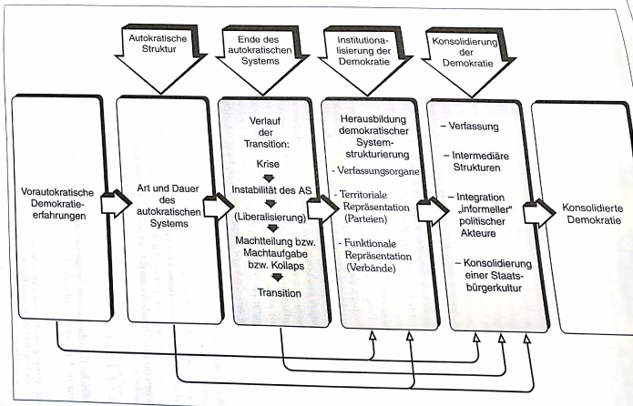
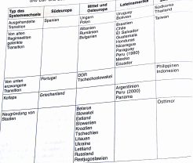
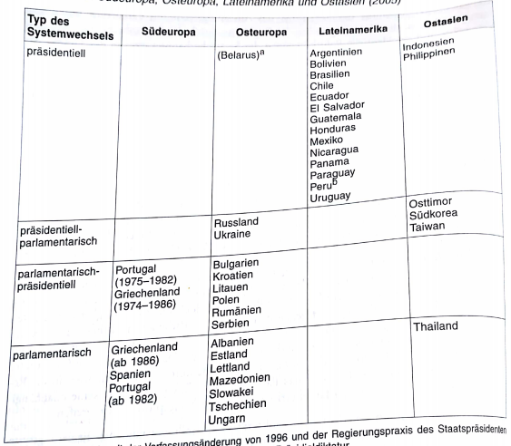

# 3. Transformationsphasen
O'Donnel & Schmitter haben Phasen des Systemwechsels von Autokratie zu Demokratie am klarsten herausgearbeitet
- allerdings orientiert an Transitionsprozessen in Südeuropa & Lateinamerika
  - häufig Einleitung von den alten Regimen, was bei Systemtransformationen nicht immer der Fall ist

Idealtypischer Wechsel von autokratischen System zur Demokratie:

Systemwechsel = Intervall zw einem alten & einen neuen pol System
- beinhaltet Auflösung der alten & Aufbau einer neuen pol Herrschaftsstruktur
- grundlegende Strukturen, Funktionen & Integrationsmechanismen werden ersetzt
  - zunächst erhebliche *Ent*differenzierung ("Auflösung") der alten Institutionen & anschließende *Re*differenzierung ("Aufbau")

Wechsel von Autokratie zu Demokratie ist nach zwei Seiten hin abgegrenzt
- erste Abgrenzung kennzeichnet Beginn der Auflösung des alten autoritären/totalitären System
- zweite Abgrenzung wird vom neu etablierten demokr. System markiert
- dazwischen legen drei Phasen des eigentlichen Systemwechsels
  - Ende des autokratischen Regimes
  - Institutionalisierung der Demokratie
  - Konsolidierung der Demokratie

## 3.1 Ende des autokratischen Systems
es ist zu unterscheiden zwischen den Ursachen und den Verlaufsformen des Endes von autokratischen Systemen

### 3.1.1 Ursachenkomplexe
welche Ursachen Systemwechsel zugrunde liegen, kann für jede Systemtransformation nur in der jeweils konkreten Analyse erforscht werden
- allerdings bisher schon soviele unterschiedliche Transformationen untersucht worden, so dass sich einige allgemeine Aussagen über Ursachenbündel & typische Verknüpfungsmuster von Ursachen treffen lassen
  - daraus kann man wiederum Hypothesen gewinnen, die konkrete Fallanalysen theorieorientiert leiten

Kombinationen von strukturellen, sozialen, politischen, ökonomischen Ursachen variieren in Anzahl, Art und Bedeutung der beteiligten Akteure & ihrer Handlungen
- deshalb immer konkrete Analyse des Ineinandergreifens von strukturellen Veränderungen & pol Handlungen von Nöten (Interdependenzen)

Stukturen & Handlungen sind die beiden fundamentalen Dimensionen, die in Analysen des Zusammenbruchs autokratischer Systeme wie auch des gesamten Systemwechsels aufeinander bezogen werden müssen
- Strukturen bestimmten Handlungskorridor, innerhalb dessen unterschiedliche Akteure versuchen, ihre Interessen mit geeigneten Handlungsstrategien durchzusetzen
  - erfolgreiche Aktionen können Handlungskorridor verbreitern & zusätzliche Handlungsoptionen ermöglichen
  - Stukturen sind nicht unbedingt nur Handlungsoptionen, sondern unter Umständen auch Handlungsressourcen

es kann systematisch zw systeminternen & systemexternen Faktoren unterschieden werden
- diese Faktoren lösen bestimmte Reaktionen bei autokratischen Eliten und der Regimeopposition aus die zum Ende eines autokr. Systems führen können

### 3.1.2 Systeminterne Ursachen
#### 3.1.2.1 Legitimitätskrise aufgrund ökonomischer Ineffizienz
autokr. Systeme sind aufgrund des umfangreichen Herrschaftsanspruch der regierenden Eliten, des Herrschaftsausschlusses großer Teile der Bevölkerung, sowie der repressiven Herrschaftsweise, mit einem *ständigen systembedingten Legitimitätsdefizit* behaftet
- zum Ausgleich erscheint vielen autoritären bzw totalitären Regimen die wirtschaftl Modernisierung als ein vergleichsweise risikoarmer Weg, um die Bevölkerung für ihre pol. Entmündung zu entschädigen

scheitert die wirtschaftl Modernisierung, so geraten diese "Entwicklungsdiktaturen ohne Entwicklung" in eine gefährliche Legitimitätskrise
- insbesonders dann wenn sich massiver gesellschaftlicher Protest formiert
  - und sich herrschende Eliten an der Frage spalten, ob sie diesem Protest mit verstärkter Repression oder vorsichtiger pol Liberalisierung begegnen sollen
  - jede Reaktion des Regimes ist mit unvorhersehbaren Risiken für Sicherung ihrer autokr Herrschaft verbunden

#### 3.1.2.2 Legitimitätskrise aufgrund ökonomischer Effizienz
Modernisierungstheorie + Lateinamerikaforschung haben auf eigentümliche Ambivalenz von Modernisierungsprozessen in autokratischen Systemen hingewiesen

Auch Erfolg der sozioökonomischen Modernisierung kann zur Krise & zum Ende autoritärer oder totalitärer Herrschaft führen

theoretisch plausible & empirisch häufig bestätigte modernisierungstheoretische Argumentation lautet folgendermaßen:
- gelingt die Modernisierungsstrategie (Wirtschaft wächst, Konsum- + Bildungsniveau steigen, sektorale Wirtschaftsstruktur verschiebt sich vom Agrar- zum Dienstleistungs- und Industriesektor) führt dies zu erheblichen Veränderungen der Sozialstruktur
  - Einfluss der reaktionären Großgrundbesitzer geht zurück
  - große Teile der einer parochialen pol Kultur anhängenden und politisch passiven Landbevölkerung werden schrittweise "wegmodernisiert"
  - starkes Anwachsen des städtischen Industrieproletariats und Herausbildung gut ausgebildeter & selbstbewusster Mittelschichten
  - diese beiden Klassen fordern mehr pol Mitsprache, verbesserte gesellschaftliche Aufstiegschancen und gerechtere Verteilung des volkswirtschaftl Ertrages
- vormoderne passiv-resignative Loyalität ggü dem autoritären Regime, weicht Forderungen nach pol & wirtschaftl Partizipation
  - eine soziale & pol Opposition entsteht
- diese nichtintendierten Effeke der Modernisierung, die zunächst ja nur die Legitimitätsreserven des autokr. Systems stärken sollen, können deshalb auch dessen Ende beschleunigen (bspw Spanien 1970er, Taiwan & Südkorea 1980er, Thailand & Indonesien 1990er)

#### 3.1.2.3 Legitimitätskrise aufgrund politischer Schlüsselereignisse
sowohl gescheiterte als auch erfolgreiche sozioökonomische Modernisierungsprozesse entwickeln besondere Sprengkraft, wenn sie mit pol Schlüsselereignissen zusammenfallen, bspw:
- Tod eines Diktators (Franco 1975)
- regimeinterne Elitenkonflikte (Südkorea 1980er)
- Häufung von Skandalen + Korruption
- Bekanntwerden von Mentschenrechtsverletzungen

solche pol Schlüsselereignisse entwickeln besonders dann dramatische Effekte, wenn sie gravierende latente Legitimationsprobleme treffen
- Zusammentreffen dieser Umstände bedeuet häufig den Anfang vom Ende des autokratischen Regimes

### 3.1.3 Systemexterne Ursachen
#### 3.1.3.1 Kriegsniederlage
Zwei Varianten nach Stepan:
- Zusammenbruch des autokr Regimes als Folger einer militärischen Niederlage gegen demokr Staaten
  - demokr Siegermächte leiten häufig (Re-)Demokratisierung ein + überwachen die Anfänge
- humanitäre Interventionen von Staatenkoalitionen als Angriffskriege gegen autokratische Regime
  - implizites o explizites Ziel über die humanitären Nothilfen hinaus ist die Einführung der Demokratie
  - Beseitigung der Dikatur führt allerdings nicht zwingend zur Demokratie

Dritte Variante nach Merkel:
- Niederlage autokratischer Besatzregime, was Weg für eine (Re-)Demokratisierung des besetzten Landes freimacht

#### 3.1.3.2 Wegfall externer Unterstützung
Wegfall einer wichtigen externen Unterstützung kann zentrale Ursache & notwendige Bedingung für Untergang eines autokratischen Systems sein

Entzug der Unterstützung autokratischer Herrschaftseliten kann wichtiger als die direkte Unterstützung demokr Oppositionsgruppen sein

#### 3.1.3.3 Dominoeffekt
Ende der südeuropäischen Rechtsdiktaturen (Mitter 1970er), Abdankung d Militärregime in Lateinamerika (Anfang 1980er), Zusammenbruch kommunistischer Systeme Osteuropas (nach 1989) lief in zeitlich konzentrierten regionalen Wellen ab

diese Ansteckungseffekte keine primären Ursachen für Ende autokratischer Herrschaftsordnungen, aber dennoch veritable "Verstärkungseffekte"

**Ursachen die Zusammenbruch eines autokratischen Herrschaftssystems herbeiführen, prägen in erheblichem Maße die Verlaufsformen der Ablösung des Regimes und des Beginns der Demokratiesierungsphase**

### 3.1.4 Verlaufsformen
sechs idealtypische Verlaufsformen für Ablösung autokratischer Systeme
- Realität: Mischformen

#### 3.1.4.1 Langdauernde Evolution
Demokratie setzt sich evolutionär, zeitlich gestreckt und nicht als Folge einer dramatischen historischen Zäsur durch

diese Verlaufsform des Systemwechsels beschränkt sich auf erste Demokratisierungswelle

#### 3.1.4.2 Von alten Regimen gelenkter Systemwechsel
Systemwechsel wird von den alten autokratischen Regimeeliten initiiert und kontrolliert

Regimeeliten bestimmen nicht nur auf welche Weise das autokr Regime abgelöst wird, sondern formen auch Strukturen des neuen demokr Systems
- Machtmitnahme teilweise für kurze Zeit möglich

Voraussetzung:
- Eliten nicht allzu diskreditiert
- Eliten haben weiterhin erhebliche Machtressourcen
- Regimeopposition vergleichsweise machtlos

wenn alte Eliten keine Militärs dann große Chance sich auch als pol Elite in neuer Demokratie zu etablieren

#### 3.1.4.3 Von unten erzwungener Systemwechsel
von unten erzwungene Systemwechsel, die nicht in Verhandlungen zw Regime- und Oppositionseliten münden, sind fast immer durch rasche Absetzung der autokratischen Machthaber gezeichnet

Voraussetzung:
- machtvoller Protest einer mobilisierten Öffentlichkeit
  - so dass Unterdrückung mit repressiver Gewalt wenig Erfolg verspricht

es folgt keine Machtteilung sondern Entmachtung alter Herrschaftsträger

#### 3.1.4.4 Ausgehandelter Systemwechsel
Wenn es zw Regimeeliten & Regimeopposition zu Pattsituation, setzen Verhandlungen über Herrschaftszugang, Herrschaftsanspruch und Herrschaftsweise ein
- eingangs unklar ob Opposition Demokratie durchsetzen kann
- evtl setzen sich Hardliner gegen Softliner des alten Regimes durch und stoppen Demokratisierung mittels Repression

#### 3.1.4.5 Regimekollaps
abrupter Zusammenbruch eines autokratischen Systems

im Unterschied zur Revolution keine "internen Akteure" verantwortlich
- vielmehr führen äußere Ursachen wie verlorene Kriege zu einem völligen Legitimitäts- und Machtverlust der herrschenden autokr. Eliten

Kollaps auch ohne direkte Außeneinwirkung möglich
- aufgrund latenter innnerer Legitimitätskrisen

#### 3.1.4.6 Zerfall und Neugründung von Staaten
autokratische Regime enden auch, wenn autoritäres o totalitäres Imperium zerfällt und neue Staaten entstehen die mit der Staatsgründung auch Chance auf demokratischen Neubeginn haben

## 3.2 Demokratisierung
### 3.2.1 Institutionalisierung der Demokratie
"Demokratisierung ist der Prozess in dem die unbegrenzte, unkontrollierte und kompromisslose eingesetze politische Macht von einer sozialen Gruppe oder Person auf institutionalisierte Verfahren verlagert wird, die die exekutive Macht begrenzen, laufend kontrollieren, regelmäßig verantwortbar machen und kontingente Ergebnisse ermöglichen" (Rüb)

entscheidener Schritt zur Demokratie ist also Übergang der pol Herrschaft von einer Person oder einer Gruppe auf ein "Set" institutionalisierter Regeln, die von allen anerkannt werden müssen

Demokratisierungsphase beginnt, wenn Kontrolle der politischen Entscheidungen den alten Herrschaftseliten entgleitet

Institutionalisierungsphase endet, wenn neue demokratische Verfassung verabschiedet ist und den pol Wettbewerb wie die pol Entscheidungsverfahren verbindlich normiert
- so gesehen ist Institutionalisierungsphase der Abschnitt innerhalb eines Systemwechsels, in dem die neuen demokr Institutionen etabliert werden
- Etappe in der alte Normen & Institutionen nicht mehr o tlw Geltung besitzen, während neue Normen & Institutionen noch nicht o tlw etabliert worden sind

### 3.2.2 Genese demokr Reigerungssysteme
Demokratische Regierungssysteme lassen sich anhand des Verhältnisses von Legislative zur Exekutive systematisch unterscheiden

systematisiert man die in der dritten Demokratisierungswelle entstandenen Regierungssysteme in die obige Typologie, so ergibt sich folgendes Bild:

Warum diese klaren Muster?
- zur Beantwortung vier Erklärungsansätze:

1. Historisch-konstitutioneller Ansatz
- Art & Gestalt der Verfassung als Ergebnis konkreter historisch-konstitutioneller Erfahrungen im eigenen Land und auf Grundlage der normativen Überzeugungen der Verfassungsgeber, sowie der soziokulturellen Besonderheiten des jeweiligen Landes erklärt
-> Lateinamerika

2. Prozessorientierter Ansatz
- es wird ein Zusammenhang des Systemwechselverlauf mit der konkreten Form des entstehenden Regierungssystems behauptet

3. Akteurstheoretischer Ansatz
- Verfassung und Form des Regierungssystems werden als Resultante rationaler Strategien & Handlungen von vor allem am eigenen Nutzen interessierter rationaler Akteure gedeutet

4. Import-Ansatz
- Verfassung und Regierungssystem werden vor allem nach dem Muster "erfolgreicher" Vorbilddemokratien geformt
