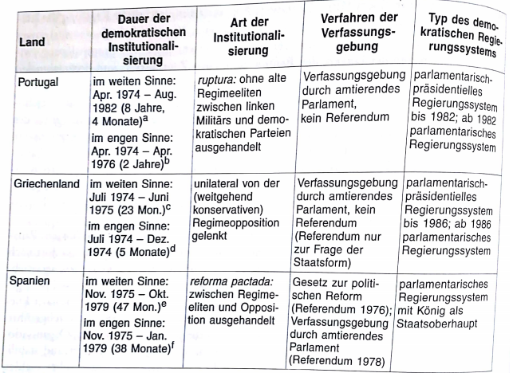
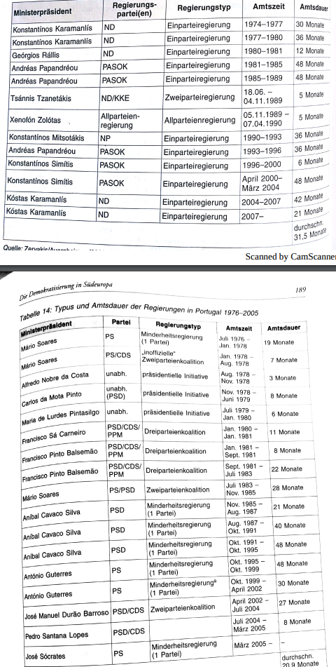

# 4. Griechenland
## 4.1 Das "nichthierarchische" Militärregime
in der ersten Hälfte des 20. Jahrhunderts nur begrenzt demokratische Erfahrungen sammelbar
- bis 1940 wechselweise von Militär- und Königsdiktaturen oder von schwachen, instabilen liberalen & semidemokratischen Kabinetten regiert
- im 2.WK Besetzung durch DE & IT
  - nach Kriegsende Bürgerkrieg(1946-1949) zwischen rechtsgerichteten Kräften & Kommunisten
    - diese traumatischen Erfahrungen prägten Politik, Gesellschaft & Kultur des Landes bis in die 1970er und spalteten das Land in zwei Lager:
      - sozialistische & kommunistische Linke (verboten, verfolgt & bespitzelt)
      - Machtkartell politischer Rechter, Militär, die Krone und zeitweise die liberale Zentrumsunion

seit 1949 bis zum Putsch der griech. Obristen 1967 zwar formal eine Demokratie
- aber durch diskriminierendes Verbot & Verfolgung der Linkung schon *de jure*(amtlich/offiziel/rechtlich betrachtet/nach Gesetz) auf undemokratische Art & Weise eingeschränkt
- *de facto* intervenierten zudem die parastaatlichen Machtzentren Hof & Militär beständig in die zivile Politik und hatten sich extrakonstitutionelle Enklaven geschaffen
- Parteienverbote, Dekrete der nationalkonservativen Exekutive & demokratiefeindliche Entscheidungen der Judikatur etablierten in Griechenland nach 1949 eine einflussreiche "Nebenverfassung"
  - mit ihr wurde die offizielle demokr. Verfassung von 1952 immer dann unterlaufen, wenn Bereiche der (extrem weit ausgelegten) "nationalen Sicherheit" tangiert schienen
    - erhebliche Einschränkung rechtsstaatlicher Garantien & pol Partizipationsrechte
      - Bezeichnung als "restriktive, exklusive, gelenkte, kontrollierte" Demokratie daher daher zu Recht

Auseinandersetzungen zw der in den 1960ern gestärkten Zentrumsunion (um Georgios Papandreou), der radikalsozialistischen Linken (um seinen Sohn Andreas Papandreou) mit dem nationalkonservativen Lager und der Krone führten nach 1965 zu innenpol Krisen & Turbulenzen
- pol Triarchie von Parlament, Monarchie & Militär geriet in eine wechselseitige Blockade
  - diese wurde 1967 durch den Putsch der Obristen aufgelöst
    - die undemokratische "Nebenverfassung", die die Nachkriegsperiode Griechenlands erheblich beeinflusst hatte, wurde damit zur offiziellen Herrschaftsnorm der Militärdiktatur (1967-1973)

Obristenregime jedoch von Anfang an mit fünf Problemen konfrontiert, die seine Legitimierung, Institutionalisierung und Konsolidierung verhinderten:
- TODO

## 4.2 Kollaps durch militärische Niederlage
### 4.2.1 Erster Legitimationsversuch
griechische Obristenregime = "non-hierarchical military regime"
- also Militärdiktatur, die die traditionellen militärischen Befehlshierarchien partiell außer Kraft gesetzt hatte
- dieser besondere Charakter sollte sich im Sommer 1973 als eine Schwäche des Regimes beweisen als in eine schwere Krise geriet

der starke Mann des Regimes (Georgios Papadopoulos) versuchte über konstitutionelle Einführung eines Präsidialsystems, der eigenen Herrschaft die dringend erforderliche Legitimität zu beschaffen
- Präsident sollte zwar mit umfangreichen Kompetenzen ausgestattet sein, aber immerhin in allgemeinen demokr Wahlen auf sieben Jahre gewählt werden

um diesen Plänen pol Glaubwürdigkeit zu verleihen, wurde eine Amnesie für pol Häftlinge erlassen, bürgerl. Freiheiten *de jure* wieder hergstellt, ein ziviles Kabinett (unter dem Konservativen Markezinis) eingesetzt und binnen Jahresfrist freie Parlamentswahlen in Aussicht gestellt

wie in vielen anderen Fällen (u.a Philippinen 1986) erwies sich die Erschließung neuer  Legitimitätsquellen für das autoritäre Regime als riskant:
1. Legitimationsversuch kam zu spät
2. öffnete Entfaltungsräume für oppositionelle Aktivitäten
3. führte zu weiterer Spaltung im herrschenden Militär

Studenten des Athener Polytechnikums nutzeten die Liberalisierungsmaßnahmen, besetzten die Universität & forderten sofortige Wiederherstellung der Demokratie
- erhielten große Sympathie seitens der Gesellschaft
- Junta schlug die Revolte im November 1973 blutig nieder
  - dies führte zu einem internen Putsch, der die Softliner ausschaltete und die Hardliner (rund um den Brigadegeneral & Chef der militär. Sicherheitspolizei Ioannides) an die Macht brachte
    - Armeespitze selbst wurde Säuberungen unterzogen
    - Trennungslinien in den Streitkräften wurden tiefer
    - die "nicht hierarchische Basis" des Militärregimes wurde noch stärker akzentuiert

es kam erneut zu verschärfter Repression
- erster Versuch der Militärs, dem Regime ein Minimum an Legitimität zu verschaffen war gescheitert

### 4.2.2 Zweiter Legitimationsversuch
der zweite Legitimationsversuch erwies sich als noch riskanter
- führte direkt zum Ende der Militärdiktatur

Militärmachthaber versuchten das innere Legitimitätsdefizit durch außenpolitische Erfolge zu kompensieren
- konspirative Machenschaften der Junta, ganz Zypern unter griechische Kontrolle zu bringen, scheiterten an der türkischen Invasion

angesichts des militärischen Desasters & der drohenden Desintegration handelte nun das "Militär als Institution" gegen das "Militär als Regierung"

Um der Kriegsgefahr zu entgehen, stellte Generalstab die hierarchische Befehlskette der Streitkräfte wieder her, setzte Ioannides ab und General Ghizikis als Interimspräsidenten(während einer Übergangszeit amtierender Präsident) ein 
- damit distanzierten sich Spitzen des Militärs von dem sich auflösenden Regime
  - um Integrität des Militärs als Institution nicht zu gefährden

Militär insgesamt allerdings *zu* diskreditiert, um das Land aus der prekären Situation zu führen
- wenig pol & gesellschaftl Unterstützung

=> Militärführung rief deshalb den Konservativen Ex-Premier Karamanlis aus dem dem Exil zurück
- enthusiastischer Empfang durch Bevölkerung und das offensichtlich gewordene Versagen des Militärs ggü der türkischen Kriegsdrohung entzog dem Militär unmittelbar jeden weiteren Einfluss auf die folgende Transition zur Demokratie

Militär kehrte in die Kasernen zurück und verschwand als Vetoakteur aus der griechischen Politik

**=> Diktatur der Obristen fand ihr beschleunigtes Ende durch eine für autoritäre Regime nicht untypische strategische Fehlkalkulation**
- Teilliberalisierung des Regimes, um Legitimitätsdefizit zu verringern
  - vorsichtige Liberalisierung entwickelte Dynamik, deren nicht intendierter, systemdestabiliserender Wirkung mit verstärkter Repression begegnet wurde => Verschärfung des Legitimationsproblems
- erneuter risikoreiche Versuch mit einem außenpol Annexionsversuch TODO

## 4.3 Der kurze Institutionalisierungsprozess
die griechische Transition "strictu sensu" erstreckte sich vom 20.Juli 1974 (Abdankung des Militärs) bis zum 17.November 1974 (Tag der ersten demokratischen Parlamentswahlen = Gründungswahlen)
- es dauerte also nur 116 Tage bis eine über demokr Verfahren bestellte Regierung das Land regierte
  - dies ist im internationalen Vergleich innerhalb der dritten Demokratiesierungswelle als außerordentlich kurz zu erkennen

Gründe für diesen schnellen Transitionserfolg lagen v.a an der Art des Zusammenbruchs des alten Regimes und der pol Strategie von Konstantinos Karamanlis als herausragender Führungsfigur des Regimewechsels
- Griechenland somit überzeugendes Beispiel für die bedeutende Rolle des politischen Handelns in Transformationsprozessen
  - Handlungsraum allerdings auch irgendwo für Karamanlis von Faktoren & Ereignissen begrenzt

komplette innen- und außenpolitische Diskredition des Regimes begünstige den raschen Regimewechsel sehr
- Obristenregime hatte von allen drei südeuropäischen Diktaturen von Anbeginn geringste Legitimationspolster
  - endgültiger Verbrauch durch Studentenniederschlag und Annexionsversuch Zyperns
- offene Kriegsgefahr & gefährdete außenpolitische + militarische Handlungsfähigkeit
  - Sicherheit der Nation & militarische Operationsfähigkeit allerdings höchste Güter professioneller Militärs
- Absetzung des "Militär als Regierung" um dem entgegenzuwirken
  - somit hatten regimeoppositionelle "Demokratiesierer" kaum Widersacher & (blockierende) Verhandlungspartner
    - außerdem kaum radikale Kräfte innerhalb der Regimeopposition die durch eine zu radikale Transformationsstrategie das Militär wieder auf den Plan hätten rufen können

Karamanlis entschärfte zudem die restlichen Risiken (Militär, militant linke Regimeopposition, nichtmilitärische reaktionäre Rechte, Probleme der Monarchie)
- indem er eine gradualisierende Strategie einschlug, die v.a. den Zeitfaktor in der Sequenzierung der Transformationsschritte mit geradezu machiavellistischer *virtu* berücksichtigte

Karamanlis Ziele waren:
1. situationsbedingte Schwäche des Militärs rasch zu nutzen
2. sukzessive Distanzierung von nationalen & semidemokratischen Rechten
3. Mäßigung der radikalen Oppositionskräfte
4. Lösung der in der Vergangenheit meist semiloyalen Krone (ggü Demokratie)
5. Bestrafung der Regimeverbrechen ohne Destabilisierungsrisiken

Karamanlis Entscheidungen:
1. eine Karamanlis erster Entscheidungen war vorübergehende Wiedereinsetzung der alten Verfassung von 1952 (bis eine legitimierte Konstituante notwendige Revisionen vorgenommen hat)
2. Monarchie wurde bis zu einem Referendum über Staatsform suspendiert
3. unmittelbare Erlassung von konstitutionellen Dekreten, die die Junta-Vorschriften +  autokraitsche Relikte in Justiz, Verwaltung & Bildungswesen beseitigen
4. Amnestie pol Gefangener
5. Legalisierung aller pol Parteien
6. EInsatz von run 75% jener höhere Offiziere, die den Säuberungen der Obristen zum Opfer fielen (Loyalitätssicherung der Armee)

Verfolgung einer "inklusiven Legitimationsstrategie"
- Einbindung aller relevanten pol Kräfte

Am 8.Dezember 1974 entschieden sich Griechen für Abschaffung der Monarchie & wählten gleichzeitig das erste demokr Parlament ohne illiberale Restriktionen

Die Institutionalisierung der Demokratie in Südeuropa im Vergleich

## 4.4 Die konstitutionelle Konsolidierung: Regierungssystem
Am 9.Juni 1975 trat die neue demokr Verfassung der III. Griechischen Republik in Kraft
- Regelung der Beziehungen innerhalb der Exekutive, sowie zw Exekutive und Legislative weniger eindeutig als Spanien
- Staatspräsident & Regierung bilden gemeinsam doppelte Exekutive (Art. 26 II)
- Art. 38 II befugt Staatspräsident die Regierung jederzeit (auch gg Willen des Parlaments) zu entlassen

Regierung benötigt Vertrauen sowohl des Parlaments wie auch des Staatspräsidenten, kann aber nicht Auflösung des Parlaments gg Willen des Staatspräsidenten durchsetzen

Parlament kann Regierung mit absoluter Mehrheit stürzen
  - muss aber keine konstruktive Mehrheit für Wahl eines neuen Regierungschefs aufbringen

Kompetenzabgreznung zw Legislative & Exekutive, sowie Machtbefugnisse zwischen Präsident und Regierungschef sind nicht präzise geregelt

überragende Figur des Ministerpräsidenten Karamanlis dominierte die aktuelle Politik, während der Staatspräsident Tsatos sich weitgehend auf die zeremoniellen Pflichten beschränkte
- als Karamanlis 1980 ins Amt des Staatspräsidenten wechselte, hielt er sich seinerseits aus Tagepolitik heraus
  - sein Nachfolger im Amt des Ministerpräsidenten (Sozialist Andreas Papandreou) führte seit 1981 mit dem gleichen Charisma und noch verstärkter Autorität die Regierungsgeschäfte

*De facto* funktionierte Griechenlands pol System von Anfang an nach den Regeln eines parl. Regierungssystem
- mit der Verfassungsrevision von 1986 wurde es auch *de jure* als solches in Verfassung festgeschrieben
- lähmende Verfassungskonflikte blieben der jungen Demokratie Griechenlands erspart

## 4.5 Die repräsentative Konsolidierung: Parteiensysteme & Verbände
Transitionsforschung zu Südeuropa ist sich weitgehend einig, dass rasche Konsolidierung der Parteiensysteme wesentlich zur erfolgreichen Konsolidierung der Demokratien beigetragen hat
- diese These soll anhand vie besonders relevanter Dimensionen der Parteiensysteme expliziert werden

### 4.5.1 Parteiensysteme
1. Fragmentierung
- Fragmentierung war kein Konsolidierungsproblem
- Dominanz der beiden großen Parteien:
  - die Konservative *Neue Demokratie*(ND)
  - die *Panhellenistische Sozialistische Bewegung* (PASOK)
- Stimmenanteil beider Parteien betrug 1974 schon 68 Prozent + liegt seit 1981 stets über 80% Prozent
- Regierungsbildung und pol Interaktion auf Parlamentsebene erfolgte nach den Regeln eines Zweiparteiensystems

2. Polarisierung (ideol. Distanz zw relevanten linken & rechten Flügelparteien) + Antisystemparteien
- vergleichbare Surveydaten liegen nicht vor
- extreme Rechte konnten keine nennenswerten Parteien herausbilden
  - aufgrund Diskreditierung durch gerade überwundene Rechtsdiktatur
  - außerdem konnte rechtskonservative ND das rechtsextreme Wählerpotential nahezu völlig in ihr Spektrum (demokr. Systempartei) einbinden
- die orthodoxen kommunistische Partei unter Florakis konnte ein größeres stabileres Segment in Wählerschaft sichern
  - Partei galt/gilt jedoch als nicht koalitionsfähig
- gemäßigt zentrifugale Tendenzen, die nicht von Antisystemparteien sondern von den beiden konkurrierenden Regierungsparteien (ND und PASOK) ausgingen
  - trug zwar zur Polarisierung der pol Kultur bei, überschritt aber auf Parteiebene nicht die demokratischen Grenzziehungen

3. Volatilität
- Messung der Summe der Netto-Wählergewinne und Netto-Wählerverluste der relevanten Parteien von Wahl zu Wahl gemessen. Niedrige Fluktuation weist auf Grad der Konsolidierung des Parteiensystems hin
- Volatilitätsrate der drei südeuropäischen Länder von den ersten freien Wahlen bis Mitte der 1970er bis Mitte 1990er höhere Wählerfluktuation. Griechenland 12,5% -> keine destabilisierende Anomalie

4. "Kritische Wahlen"
- volatiliy verbirgt Zäsur/dramatische Wählerverschiebung einer bestimmten Parlamentswahl -> solche als "kritische Wahlen" bezeichnet. Kritisch, weil offen ob dekonsolidierendes dealignment in ein konsolidierendes realignment einer erneuten Wähler-Partei-Bindung mündet.
- Tritt erneute Bindung nicht ein, bleibt Konfiguration des Parteiensystems instabil. Solch instabiles Parteiensystem kann in nicht konsolidierten Demokratien erhebliche destabilisierende Wirkungen entfalten -> vor allem der Fall, wenn in raschen Abständen dramatische Wählerverschiebung zwischen Parteilagern. (interbloc volatility).
- anhaltende Volatilität könnte in Parteienverdrossenheit münden, im worst Case Demokratieverdrossenheit. -> folgt rasche Realignment auf kritische Wahl, kann diese entscheidende Zäsur zwischen noch nicht gefestigtem transitorischen hin zu einem stabilen Parteiensystem darstellen. 
- in Griechenland 1981, nach der Wahl stabilisierte sich das Parteiensystem wieder.

### 4.5.2 Verbände in den industriellen Beziehungen
 wie in meisten Transformationsländern dauert in Portugal, Griechenland und Spanien die Konsolidierung der funktionalen Interessenrepräsentation bei den beiden großen Verbänden von Kapital und Arbeit länger als die rasche erste Konsolidierung der Parteien und Parteiensysteme. Vor allem Herausbildung stabiler Verhandlungsmuster zwischen Gewerkschaften und Arbeitgeberverbänden erwies sich zunächst als schwierig und von Konflikten besetzt. 

industrielle Beziehungen der Länder weder syndikalistischen noch korporatistischen Typ zuzuordnen. Grieschiche Arbeitsbeziehungen von etastischen Korporatismus geprägt. 

die Interessengruppen und Verbände waren in Griechenland stets organisatorisch unterentwickelt, institutionell schwach und eng am parteipolitischen Dualismus von ND und PASOK ausgerichtet
  - in Verfassung von 1975 erstmals gewerkschaftliche Streikrecht und das kollektive Tarifvertragsrecht explizit verankert
  - jedoch vor allem 1975-1980 von Regierung restriktiv ausgelegt 

griechische Gewerkschaften sind organisatorisch zersplittert, von parteipolitischen Konflikten durchzogen
- Gewerkschaften nach Prinzip der Einheitsgewerkschaft organisiert, doch diese Einheit wird mehrfach gebrochen durch: Konkurrenz, 4000 Einzelgewerkschaften sowie richtungspolitische Konkurrenz innerhalb größten gewerkschaftlichen Dachverbands GSEE
- Gewerkschaften stehen schwache Arbeitgeberverbände gegenüber
  - Bis 1985 kaum Gehör bei Regierung.
- organisatorische Fragmentierung der Arbeitgeber- wie Arbeitnehmerseite, die Reformverschlossenheit der Unternehmerverbände bis weit in die 1980er hineun und die steten Versuche der Regierung, Gewerkschaften zu instrumentalisieren, haben Griechenland während Phase der demokratischen Konsolidierung keine kooperative Arbeitsbeziehungen entstehen lassen
  - Folge -> Gewerkschaften streikten oft für Durchsetznung ihrer Interessen. 

## 4.6 Die Integration der Vetoakteure
- in Periode postautoritärer Umbrüche, extrakonstitutionelle Vetorolle des alten Regimes gegenüber zivilen demokratischen Politik beansprucht.
- mächtigste und für Demokratie bedrohlichste Vetoakteur das Militär. Vor allem dann Risiko, wenn mit vorangegangenem autoritärem Regime eng verbunden. -> vor allem in Griechenland und Spanien der Fall. Mussten sich in eigenem Interesse schützen unter Verbrechen autoritären Regimes gezogen zu werden. Keine politische Rolle des Militärs in Griechenland. 
- Morlino und Montero: in den drei Ländern sind realisitische politische Kulturen wiederzufinden, in denen die Unterstützung für Demokratie groß ist und die autoritäre Vergangenheit nur von einer Minderheit bedacht wird. Daher wurden die Südeuropäischen Ländern legitimiert und konsolidiert in Mitte der 1980er. 
- zwei Dimensionen politischer Legitimität: diffuse legitimacy und perceived evvicacy, entsprechen weitgehend Eastons diffuse- und specific support. Aus diesen beiden konstruieren sie 4 Idealtypen von Bürgern in ihren Einstellungen gegenüber der Demokratie. 

1. full democrats: "überzeugte Demokraten", die die demokratische Legitimität bedingungslos anerkennen und Demokratien als effiziente Systeme betrachten.
2. critics: "kritische Demokraten", die die Demokratie der Autokratie vorziehen, aber gleichzeitig ihr eigenes demokratisches System als ineffizient wahrnehmen.
3. satisfied: "Schönwetterdemokraten", die zwar ihr demokratisches System als effizient wahrnehmen, aber unter Umständen auch ein autoritäres System akzeptieren würden
4. anti-democrats: lehnen Demokratie als Herrschaftsordnung ab 

Griechenland weist bei überzeugten Demokraten und Antidemokraten demokratiefreundlichste Werte auf. Generell mehr Demokraten als Antidemokraten. 
- Griechen auf Frage ob Demokratie Autokratie vorzuziehen zu sei, 90% befürwortet. Nach Morlino und Montero Gründe: Griechenland am stärksten politisierte Gesellschaft der drei aufgeführten Länder und Griechen zeigen mehr Interesse der Politik entgegen. Außerdem weist Griechenland größte Abneigung der Diktaturen der eigenen unmittelbaren Vergangenheit auf. Dies liegt vor allem an der kurzen Herrschaftsdauer des autoritären Systems und seiner geringen sozialen Verankerung. 

Parteien am wenigsten vertraunswürdig in den drei Ländern. 
- Gründe: häufige Involvierung in Korruption, Herausstellung der Parteienskandale, negative Wahrnehmnung des Konfliktverhaltens etc. -> gelten für meisten Demokratien 

Morlino und Montero: Wähler der rechten Parteien ließen gegenüber der diffusen Legitimität die geringste Unterstützung erkennen und bewerteten die autoritäre Vergangenheit am günstigsten, Wähler linker Parteien, zeigen konsistent signifikant höhere Unterstützungswerte für die Demokratie als Wähler von Rechtsparteien.

