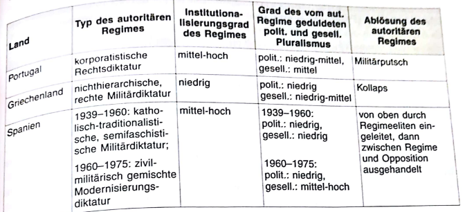
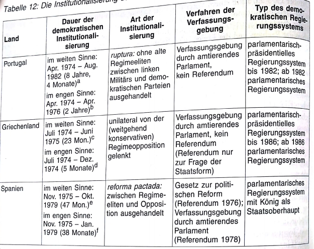

# 4. Spanien (dritte Demokratisierungswelle)
Spanien verfügte kaum über demokratische Erfahrung vor Etablierung des autoritären Regimes
- Erfahrungen lagen außerdem weit zurück und geprägt durch Konflikte & Stabilität

19.Jhd in Spanien geprägt vom Widerstreit zw liberalen Konstitutionalisten & monarchistischen Traditionalisten
- Reform <-> Gegenreform & Revolution <-> Militärputsch prägten diese Periode

die 1867 von Bourbonen erlassenen konservative Verfassung konnte Staat & Gesellschaft nur vorübergehend stabilisieren
- ließ zwar Wechsel von konservativen & liberalen Parteien in Regierungsverantwortung zu
  - basierend jedoch (genauso wie Parlament) auf Wahlen, die von Zensus/Frauenausschluss/Manipulation geprägt waren

1923 ging mit dem Putsch von Miquel Primo de Rivera (Generalkapitän Kataloniens) die restaurative Phase der konstitutionellen Monarchie (geprägt wirschaftlichen, pol. und wirtschaftlichen Krisen der ersten beiden Dekaden des 20.Jhd (1900-1920)) zu Ende

auch das Staatskonzept Primo de Riveras konnte die sich im Aufbruch befindliche span Gesellschaft nicht "verfassen"/stabilisieren
- Ausbau eines autoritären Ständestaates mit faschistischen Elementen scheiterte schon in den Anfängen
- unter wachsenender Opposition von Arbeitern, Gewerkschaften, Intellektuellen & schließlich sogar Teilen der Armee brach dieses fragile autoritäre System zusammen

## 4.1 Gründung der ersten Demokratie (Zweite Spanische Republik)
1931 Gründung der Zweiten Spanischen Republik (1931-1936/1939)

Übergang zur Demokratie verlief friedlich
- Gründung auf Wahlerfolgen der republikanischen Parteien & kooperative Steuerung von konservativen, liberalen & sozialistischen Eliten

jedoch waren die knapp 6 Jahre (insbes. nach 1933) der ersten span. Demokratie nicht von Kooperation, sondern von weltanschaulichen Konflikten, unüberbrückbaren Interessen, pol Gegensätzen & Proliferation der pol Gewalt geprägt
- tiefe Konfliktlinien zwischen:
  - Kirche & Laizismus
  - anarchosyndikalistisch organisierten Arbeitern & reformfeindlichen Kapitalisten
  - Landarbeitern & Großgrundbesitzern
  - nationalistischen Zentralstaatsbefürwortern & regionalistischen Sezesionisten
  - pol organisierten Parteien der Linken & der Rerchten

trotz Konfliktreichtums stärkere positive Bewusstseinsprägung vieler Bürger, als Demokratieerfahrungen in Griechenland/Portugal 

Zweite Spanische Republik scheiterte an extremter Kumulation ihrer Probleme & starker Polarisierung + Mobilisierung der pol & gesellschaftl. Organisationen, Klassen und Gruppen
- führten zwar nicht zum Zusammenbruch der Demokratie, aber motivierten bedeutende Teile der Armee unter General Francisco Franco zum bewaffneten Angriff auf die Republik
  - dies mündete in langem Bürgerkrieg mit Zehntausenden von Todesopfern (1936-1939)

## 4.2 Das institutionalisierte Führerregime Francos
Opfer des Krieges, den Francisco als *cruzada* (Kreuzzug) bezeichnete, prägten & spalteten das Land bis in die 1970er (*das* traumatische Erlebnis Spaniens im 20.Jhd)

Kern der frankistischen Revolte war zunächst militärisch
- jedoch gestützt von breiter Allianz des traditionellen, monarchistischen, konservativen & katholischen Spaniens

nach 3 Jahren Bürgerkrieg wurde Diktatur Francos 1939 nur durch ein einfaches Gesetz etabliert

Institutionalisierungsgrad der Diktatur blieb auch später geringer, als der autoritär-korporatistische Anspruch es zunächst vermuten ließ

Puhle: "frankistische Herrschaft war khatolische, militärische, semifaschistische (aber nicht klerikal-faschistische), autoritäre Diktatur, in der monarchische Elemente mit der Zeit zunahmen & später insbes. auch solche einer gelenkten Diktatur"

Regime war auf die Person Francos zugeschnitten
- Unterstützungskoalition des Regimes aus Militär, Polizei, Großgrundbesitz, reaktionärem Industriekapital, khat Kirche und konservativem Staatsapparat blieb allerdings über Francos Tod hinaus eine machtpol + kulturelle Erblast für jede Demokratisierung
- altes Franco-Regime genoss in der Bevölkerung weit mehr Zustimmung als die autoritären Regime Portugals & Griechenlands
  - Spanien hatte das schwierigste pol Erbe für Etablierung der Demokratie

Bürgerkriegstrauma & unterdrückte Linke boten zudem mit latenter Gefahr einer erneuten Polarisierung ein erhebliches Risikopotential für jeden demokr. Regimewechsel

## 4.3 Regimeübergang: Die von oben gelenkte *reforma pactada*
Herrschaftsbasis des autoritären Regimes war schon vor Francos Tod (Nov 1975) brüchig geworden
- Kirche hatte aktive Unterstützung entzogen
- neue Industrieelite betrachtete Diktatur als hinderlich für weitere wirtsch Expansion
- staatl Institutionen hatten in Bevölkerung zunehmend an Unterstützung verloren
- traditionelle Werte des khatolisch-autoritären Spaniens korrespondierten immer weniger mit Modernität der weitgehend säkularisierten Gesellschaft

faktische Monopol des staatlichen Zwangsapparates (Armee, Polizei, Sicherheitsdienste, pol Justiz, Verwaltung) allerdings weiterhin in Händen der frankistischen Regimeeliten

dieses prekäre Equilibrium zw staatl & gesellschaftl Macht kann den Verhandlungscharakter des Regimewechsels erklären

Tod Francos brachte kein Ende der autoritären Ordnung mit sich, aber die ungebrochene Kontinuität des frankistischen Herrschaftssystems war ohne den "Caudillo" (Oberhaupt/Kopf) oder eines charismatischen Nachfolgers kaum denkbar

Übergangsprozess verlief unter diesen Umständen (im Gegensatz zu Griechenland/Portugal wo abruptes Versagen -> ruptura) nicht als rascher Regimewechsel, sondern als langsamer Regimewandel

Regimeeliten wurden nicht sofort abgesetzt, verhaftet oder verbannt, sondern blieben an der Macht

alte frankistischen Herrschaftseliten wollten den Übergang zunächst als eine exklusiv von oben gesteuerte *reforma* gestalten
- Regimeopposition bevorzugte hingegen eine eindeutige & rasche Abkehr vom Autoritarismus
  - Softliner des alten Regimes konnten Regimewandel deshalb nicht unilateral von oben steuern, sondern mussten in einen Dialog mit den erstarkten Kräften der Opposition eintreten

*transicion pactada* (die ausgehandelte Transition) als Resultat/Kompromiss des Tauziehens zw Regimefrankisten & Opposition
- Spanien Regimewechsel wurde in politikwiss. Transformationsforschung rasch zu *dem* paradigmatischen Fall einer *paktierten Transition* (ausgehandelte + paktierte Regimewechsel), in der der Kurs einer "von oben" eingeleiteten Transformation durch den Druck "von unten" mitbestimmt & beschleunigt wurde

Franco hatte schon zu Lebzeiten Prinz Juan Carlos als seinen Nachfolger an der dann monarchischen Spitze des Staates bestimmt
- König sollte allerdings nicht die Machtfülle des Caudillos besitzen, sondern durch alte Herrschaftsinstitutionen des Regimes (zb *Consejo del Reino* und den *Cortes*) unterstützt und regimetreu eingerahmt werden

zu Beginn der Transition war also noch unklar, ob der neue König sich stärker der Demokratie oder einer monarchisch-autoritären Herrschaftsform zuwenden würde
- für letzteres sprach zunächst Ernennung des Alt-Frankisten Arias Navarro zum Ministerpräsidenten und die Dominanz der regimetreuen Frankisten in den *Cortez*
  - Navarros Strategie zur Etablierung einer regimegelenkten "eingeschränkten" Demokratie scheiterte jedoch an Opposition & König

unterschiedliche Gruppen der Opposition nutzen Liberalisierung des alten Regimes um sich in der *Coordinacion Democratica* (CD) zusammenzuschließen
- unter diesem organisatorischen Dacht gelang es, die oppositionellen Aktivitäten von Christdemokraten, Liberalen, Sozialdemokraten, Sozialisten, Kommunisten, Maoisten + illegalen Gewerkschaften zu koordinieren und die restaurative Politik von Arias Navarro durch Streiks & soziale Mobilisierung zu verhindern

als klar wurde , dass die Regierung Navarro keine weiterführenden Verhandlungen mit der Opposition aufnehmen wollte, veranlassten eine Abstimmungsniederlage im Parlament durch die frankistischen Hardliner (des sogenannten *Bunkers*), sowie der Druck des Königs, Navarro zum Rücktritt
- Ernennung Adolfo Suarez zum neuen Ministerpräsidenten, stellte Weichen für die weitere Demokratisierung
- zweite wichtige Etappe (nach Francos Tod) der Ablösung des alten Regimes somit durchschritten

dritte Phase von Juni 1976 bis Dezember 1978 war von Verhandlungen zw reformorientierten postfrankistischen Eliten einerseits & Opposition andererseits bestimmt
- es ging nicht mehr darum ob Demokratie o Autokratie, sondern um konkrete Modi & Tempi des Übergangsprozesses + die demokr Regierungsform
- vereinbart wurde:
  - das grundlegende "Gesetz über die politische Reform" (1976)
  - der Modus der ersten freien parlamentsWahlen (1977)
  - der Inhalt der demokr Verfassung (1978)
- Beginn der Demokratieinstitutionalisierung

## 4.4 Institutionalisierung der Demokratien: Der ausgehandelte Institutionalisierungsprozess
Institutionalisierung der Demokratie erwies sich von allen drei südeuropäischen Ländern in Spanien am schwierigsten
- weder Institutionen noch alte Herrschaftseliten konnten durch einen radikalen Bruch beseitigt/entmachtet werden
  - Opposition dafür zu schwach und Vetoakteur Militär zu mächtig
- Risse im frankistischen Herrschaftsblock tief und Regimeopposition dennoch stark wenug, sodass sich beide Seiten benötigten
  - dieses Bewusstsein der Angewiesenheit führte nach und nach zu Gesprächen der pol Führer beider Lage, die bald Charakter von Verhandlungen annahmen

Ergebnis war ein von Eliten beider Seiten ausgehandelter Institutionalisierungsprozess, der über 4 Etappen verlief und an dessen Ende 1978 ein konstitutionell voll entwickeltes liberaldemokr System stand:
1. Das Gesetz zur politischen Reform (Ley para la Reforma Politica): 
  - Suarez gelang es die Zustimmung der Spitze des *Movimiento* und des noch frankistisch-besetzten *Cortes* zu einem Gesetz zu erlangen, das mit Volkssouveränität, Einführung des allgemeinen Wahlrechts + Verfahren für Verfassungsreform den Grundstein für eine Institutionalisierung des pol Systems legte
    - wurde am 15.12.1975 in einem Referendum mit 94% (Wahlbeteiligung 78%) angenommen
    - damit gelang es Suarez die Verfahrenslegalität des frankistischen Grundgesetzes zu wahren, die Zustimmung der Mehrheit der alten Eliten zu erhalten + dennoch eindeutig den Weg zur Demokratie zu beschreiten
2. Legalisierung der Kommunistischen Partei:
  - im April wagte Suarez den Schritt zur Legalisierung der Kommunistischen Partei, welche auch 40 Jahre nach dem Bürgerkrieg noch einem regelrechten Kreuzzug seitens des Militärs und der Hardliner unterlag
    - trotz Kritik von dieser Seite kam es zu keinem pol Veto
  - nicht nur Beseitigung illiberaler Restriktion, sondern auch Voraussetzung für Einbau der Kommunisten, die eine beachtliche Mobilisierungsfähigkeit in der Industriearbeiterschaft verfügten, in das demokr Institutionalisierungsprojekt
3. Gründungswahlen von 1977:
  - Juni 1977: erste freie + unbeschränkt kompetitive Wahlen
  - bürgerliche Zentrumsunion UCD von Adolfo Suarez erhielt rel Mehrheit (34.6%)
  - Sozialisten (PSOE) zweitstärkste Partei (29.4%)
  - rechtsgerichtete Alianza Popular (8.4%)
  - Kommunistische Partei PCE (9.4%)
  - Wahlergebnis hatte zwei pos Effekte:
    - gemäßigte Parteien der Mitte ~2/3 der Stimmen (aufgrund des verstärkten Verhältniswahlsystems ~3/4 der Parlamentssitze)
    - Herausschälung zwischen der Linken und Rechten zwei gleich große Lager heraus, die einer zentripetalen (nach innen, zur Mitte) Wettbewerbslogik folgten
4. Ausarbeitung & Verabschiedung der Verfassung:
  - alle vier im Parlament vertretenen gesamtspanischen Parteiene (AP, UCD, PSOE, PCE) sowie die katalansichen Nationalisten (CiU) waren aktiv an Arbeiten zur demokr Verfassung beteiligt, wobei Schlüsselentscheidungen nur von Parteispitzen getroffen wurden (UCD + PSOE dominant)
    - simultan wie Verhandlungen zw Regime & Opposition in früheren Institutionalisierungsprozess eindeutig elitengesteuert
  - außenparlamentarische Druck durch Streik, Streikdrohungen & Demonstrationen  stärkte Verhandlungsposition der demokr Kräfte
  - bloße Existenz des Militärs wirkte stets restriktiv und als Risikofaktor für den gesamten Demokratisierungsprozess

Konsens- und Kompromisscharakter der Verfassungsausarbeitung wurde von nahezu allen Mitgliedern des Parlaments getragen
- ganz wenige Gegenstimmen
- mit 87,7% allgemeine Zustimmung der span Bürger

=> somit wurde zunächst prekär scheinene Institutionalisierung der Demokratie in Spanien in einem mehrstufigen Verfahren weitgehend abgeschlossen
- von den 3 neuen demokr Verfassung Südeuropas verfügt spanische *constitucion* zweifellos über die demokratischste Verfahrenslegitimität

Institutionalisierung hielt im weiten Sinne jedoch noch bis zum 31.Oktober.1979 an, als in einem Vorgriff auf die spätere verfassungsrechtliche Regelung das letzte der dreizehn Autonomieregimes der spanischen Regionen eingerichtet wurde
- vorläufige "Entscheidung für die Nichtentscheidung" in Hinblick auf Autonomiefrage als ein wesentlicher Beitrag zur Entlastung der Transitionsagenda

"Problem der Staatlichkeit" konnte in Spanien durch kluge Politik des *timing and sequencing* erheblich entschärft werden
- dazu zählt Terminierung der Wahlen
  - mit Bedacht zunächst auf nationaler Ebene (1977) und dann schrittweise in den *Comunidades Autonomas*
    - kann in Staaten die ein virulentes Staatlichkeitsproblem haben, die Gefahr sezessionistischer Desintegration entschärfen

Abschließend ist auch die Person und das konkrete pol Handeln von König Juan Carlos zu erwähnen
- trug wesentlich zum Gelingen der demokr Institutionalisierung bei
- repräsentierte als Monarch die Einheit & territoriale Integrität des Staates
- schien als Nachfolger Francos als Verkörperung des alten Regimes

=> beides war wichtige Voraussetzung, fur Akzeptanz von Streitkräften als Oberbefehlshaber + von Militär & frankistischem *Bunker* als Garant ihrer Interessen und Werte
- gleichzeitig erwies er sich als reformaufgeschlossen

Ernennung von Adolfo Suarez zum Ministerpräsidenten durch König Juan Carlos muss als eine der frühen Schlüsselentscheidungen für Demokratisierung angesehen werden
- Legitimation königlicher Ernennung öffnete Suarez zusätzlichen Handlungsspielraum, den dieser durch demokr Wahl ggü den autoritären Vetokräften nie hätte erhalten können

