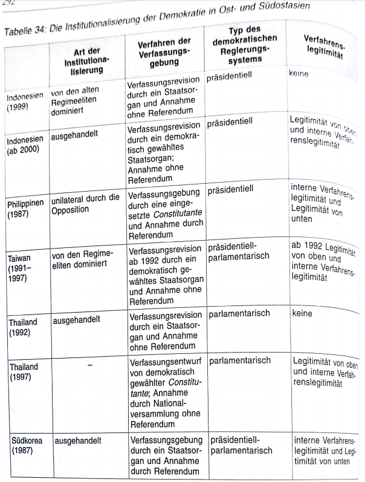
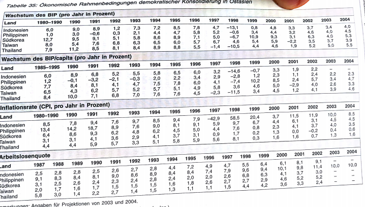

# 9. Philippinen
## 9.1 Institutionalisierung: Wiederherstellung des präsidentiellen Regierungssystems
Wahlsieg Corazon Aquinos und Auseinanderbrechen der auf die Person Marcos zugeschnittenen autoritären Herrschaftskoalition ebnete Weg für demokr Rückeroberung der pol Institutionen durch Opposition
- Opposition und ihre provisorische "Revolutionsregierung" unter Corazon Aquino stößt tlw. allerdings auch auf Ablehnung
  - konfrontiert mit heftigem Widerstand der Anhänger des alten Regimes, abtrünniger Militärs und versch. Guerillaorganisationen
  - aufgrund ihrer zweifelhaften demokr. Legitimät auch im Lager der Marcos-Gegner umstritten

Bereits nach einem Monat des Amtsanritts der provisorischen Regierung Erlass einer Interimsverfassung, die die alte Marcos-Verfassung außer Kraft setzte
- interim = inzwischen, einstweilen -> Interimsverfassung = vorläufige Verfassung / Übergangsregelung
- Ausarbeitung der neuen Verfassung wurde währenddessen einer Kommission übertragen
  - Mitglieder dieser Kommission waren von Präsidentin(Corazon Aquino) ernannt

Einigung auf Kernpunkte der neuen Verfasssung innerhalb weniger Monate:
- angelehnt an die erste philippinische Verfassung von 1935

**1. Stärkung des unter Marcos entmacheteten Obersten Gerichtshofs**
- Orientierung am US-amerikanischen Modell hinsichtlich der Kompetenzausstattung
- Neuregelung des Verfahrens zur Besetzung der Richterposten stärkt pol. Unabhängigkeit erheblich (war unter Marcos aufgehoben)
  - zusammen mit Prinzip der Nichtabberufbarkeit der Obersten Richter, um einseitige Zusammensetzung des Gerichts durch Exekutive zu verhindern

**2. Wiederherstellung des präsidentiellen Regierungssystems (der ersten philip. Demokratie)**
- anstelle des unter Marcos *formal* eingeführten, aber faktisch nie umgesetzten, Semipräsidentialismus
- Einschränkung der von Marcos weitreichend gefassten präsidentiellen Notstands- und Verordnungsrechte
- philip. Präsident besitzt die ausschließliche Zuständigkeit für Entwurf & Vorlage des Haushaltsgesetzes
- Präsident besitzt *nicht* das Gesetzesinitiativrecht
- Präsident kann bei Rebellion, Wirtschaftskrise, Katastrophen etc. den Notstand erklären
  - Proklamation(Ausrufung) bedarf jedoch Zustimmung des Kongresses mit qualifizierter Mehrheit in beiden Häusern
- Beschränkung der Amtszeit des Präsidenten auf sechs Jahre ohne Möglichkeit zur Wiederwahl

**3. Wiederherstellung eines Zweikammersystems (bestehend aus Senat und Repräsentatenhaus)**
- nach US-amerikanischem Vorbild, wie es bereits 1946 etabliert wurde (Tabelle 34)
- beide Kammern weitegehend gleichberechtigt am Gesetzgebungsverfahren beteiligt 
- ähnlich wie bei Präsidentenamt Einführung von Amtszeitbeschränkungen für das Parlament
  - max zwei konsekutive (nachfolgende) Amtszeiten für den Senat bzw. drei für das Repräsentatenhaus
    - plus Möglichkeit einer erneuten Kandidatur zu einem späteren Zeitpunkt

Institutionalisierung der Demokratie wurde mit einem Verfassungsreferendum im Februar 1987 mit einer Dreiviertelmehrheit der abgegebenen Stimmen abgeschlossen
- anschließend freie Kongresswahlen im Mai 1987 (gelten als Gründungswahlen der Demokratie)

Mobiliserung von unten zwar wichtige Rolle bei Ablösung des Marcos-Regimes, jedoch muss Institutionalisierungsphase der Demokratie dennoch als das **gesteuerte Projekt einer alten, seit Jahrzehnten im pol. System verwurzelten pol Elite gelten**
- welche lediglich zeitweise aus den pol Entscheidungspositionen vertrieben war, aber nun in diese zurückkehrte

## 9.1.1 Institutionalisierung: Fazit (allgemein)
All: Wahlen markierten als Schlüsselelement den demokr. Übergang
- Philippinen: Präsidentschaftswahlen
- Einführung demokratischer Verfahren verlief in Philippinen zeitlich parallel mit dieser Wahl
  - nur wenige Monate zwischen Verabschiedung einer neuen, demokr. Verfassung und demokr. Gründungswahlen

P: ausgearbeitete Verfassung formal genuin neu
- inhaltich tief in konstitutioneller Tradition verankert
- Verfassung kann sich aufgrund ihrer Annahme durch ein Referendum auf eine Legitimation "von unten" stützen

All: Systemwechsel zeigen, dass "institutionelle Revolutionen" auch in Transitionsprozessen selten sind
- in keinem Land ist Umbruchssituation zu einem grundlegenden Wechsel des Regierungssystems (von einem präsidentiell dominierten zu einem parlamentarischen System) genutzt worden

All: Eigene Verfassungstraditionen wurden meist fortgeschrieben
- P: erneut aufgegriffen und durch neuen institutionellen Feinschliff modifizert
- A o P?: dieser Feinschliff berührte in unterschiedlicher Gewichtung das Verhältnis von Exekutive & Legislative, sowie Stellung der (Verfassungs-)Gerichtsbarkeit
- Stärkung der Kontrollrechte der Legislative ggü Exekutive
- Schwächung der Rechte der Präsidenten ggü Legislative

All: Hinsichtlich Stellung der Judikative im Verfassungsgefüge ist durchgängige Institutionalisierung einer Verfassungsgerichtsbarkeit hervorzuheben
- P: in Gestalt des amerikanischen Modells der funktionalen Verfassungsgerichtsbarkeit durch einen Obersten Gerichtshof

All: Regierungssysteme erfüllen Grundvoraussetzung der *judical review* im demokr. Rechts- und Verfassungsstaat

## 9.2 Konsolidierung
Ende des autoritären Regimes & Institutionalisierung führte zu Neuordnung der pol. Organisation des Staates und seiner Beziehungen zur Gesellschaft
- Regimewechsel führte allerdings nur sehr begrenzt zum Austausch der alten politischen Eliten
- Gründungswahlen erwiesen sich nicht unbedingt als effektives Instrument des Elitenaustausches
- auf Philippinen kam es zwar noch am ehesten zu einem Elitewechsel
  - aber *reconquista* der pol. Herrschaftspositionen durch die neuen ("alten") demokratischen Eliten aus der Periode vor dem Marcos-REgime (1946-1972) belastete die Konsolidierung hier am stärksten

## Die blockierte Konsolidierung
in kritischen Anfangsjahren wurde effektive Herrschaftsgewalt der demokr. Regierung unter Corazon Aquino gleich von mehreren Seiten massiv in Frage gestellt
- am rechten Rand von gewaltbereiten Anhängern des Marcos-Regimes (Loyalisten) innerhalb des Militärs + rechtsextreme Gruppen junger, putschbereiter Militärs der mittleren Offiziershierarchie
- am linken Rand von der maoistisch orientierten *Kommunistische Partei der Philippinen* (CPP) mit ihrer Volksfrontorganisation, sowie ihrem bewaffnetem Flügel, dew *New People's Army* (NPA)
- zudem verschiedene sezessionistische moslemische(muslimische) Rebellenorganisationen, die auf der südlichen Inselgruppe Mindanao gegen die Zentralregierung in Manila agierten

Gruppierungen konfrontieren die junge Demokratie mit ihrem konkurrierenden Gewaltanspruch
- Kommunistische Guerilla führte seit 1970ern einen revolutionären Volkskrieg und kontrollierte auf dem Höhepunkt ihrer Erfolge (Mitte der 1980er) etwa 20% des Staatesgebiets und hielt 25.000 Kämpfer unter Waffen
- im Süden operierten zeitweise mehr als 20.000 muslimische Kämpfer
- vor allem jedoch Aussetzung einer regelrechten Belagerung durch Teile des eigenen Militärs in den ersten vier Jahren
  - zwischen Februar 1986 und März 1990 erhebte sich das Militär acht mal
    - Coups und Coupdrohungen dominierten die Politik in jenen Jahren, blockierten soziale Reformen & verlangsamten die ohnehin lahmende volkswirtsch. Entwicklung

-> Umsturzversuche der aufständischen Militärs scheiterten, die Kommunistischen Aufständischen kontrollierten nach mehreren pol. & militär. Niederlagen nur noch kleine Gebiete und der muslimischen Guerilla gelang es nicht stabile territoriale Enklaven im Süden des Landes zu errichten
- trotzdem erhebliche negative Auswirkung auf Konsolidierung der Demokratie
  - Entstehung eines Autoritätsvakuums in einzelnen Gebieten, das von nichtstaatlichen Akteuren zum Aufbau paralleler Machtstrukturen genutz wurde
  - anhaltende Widerstände behinderten die Institutionalisierung ziviler Kontrolle über die Streitkräfte, da diese die Bedrohung der territorialen Integrität als Vorwand für pol Interventionen brauchten (???)

Militär hat sich somit zu einem der wichtigsten Akteure der philip. Politik entwickelt, der sich seine "Loyalität" mit pol Vorrechten vergüten lässt
- nach einer scheinbaren Normalisierung der Lage (in Mitte-Ende der 90er), wurde dies während der Auseinandersetzung um die Amtsenthebung von Präsident Joseph Estrada im Januar 2001 wieder ersichtlich
  - so wie im Februar 1986 gab das parteiische militärische Eingreifen den Ausschlag für die neue Präsidentin Gloria Macapagal Aroyo
    - am 24.Februar 2006 verhängte die Präsidentin nach Hinweisen der Sicherheitskräfte (auf einen bevorstehenden Putschversuch einiger Spezialeinheiten der Streitkräfte)  den Ausnahmezustand

mangelnde Durchsetzungsfähigkeit der gewählten Reigerung ist nicht das einzige Konsolidierungsdefizit der phillipinischen Demokratie, denn die seit 1987 regelmäßig stattfindenen allgemeine, freie **Wahlen sind defizitär**
- pol Gewahlt bei Wahlen
  - zwar Rückgang aufgrund organisatorischer Verbesserungen und Schwächung systemfeindlicher Gruppierungen, aber dennoch kommt es zu Einschüchterung von Wählern + Kandidaten, bis hin zum pol. Mord
  - weit mehr als in anderen ost- und südostasiatischen Demokratien
- Manipulation von Wählerregistern, Stimmzetteln und Stimmenauszählung
  - Wahlbehörder trotz weitreichender Befugnisse bislang nicht gelungen ordnungsgemäße Durchführung zu garantieren
- Stimmenkauf und Verstöße gegen Wahlgesetze
- politische Rechte + Vertreter der wirtschaftl. dominierenden Oligarchie nutzen Wahlen & demokr Institutionen zur Sicherung ihrer eigenen *vested interests*(= Eigennutz, persönliches Interesse)
- Wiederwahl von Präsidentin Gloria Macapagal Arroyo im Mai 2004 von massiven Vorwürfen des Wahlbetrugs begleitet

## 9.2.1 Gewaltenkontrolle
im Gegensatz zu diesen Konsolidierungsproblemen zeichneten sich die Philippinen bislang durch eine naehzu strikte Einhaltung der konstitutionell vorgegebenen Kompetenzabgrenzungen & Verfahrensregeln im Bereich der horizontalen Gewaltenkontrolle aus

mit dem Senat hat sich ein kompetitiver Vetospieler herausgebildet, der eine hohe Blockadekapazität ggü Politikvorhaben der Exekutive besitzt
- -> wiederholt wurden prominente Vorhaben der Regierung vom Kongress nicht behandelt oder bereits zuvor von Regierung fallengelassen da hohe Wahrsch. des Scheiterns
- dieses parl. Gegenwicht hat aufgrund seiner Natur aber auch Kosten:
  - langwierige Gesetzgebungsverfahren
  - Blockaden und Verwässerungen reformerischer Projekte durch den Kongress im Bereich der Wirtschafts- und Sozialgesetzgebung

Oberster Gerichtshof bildet einen wichtigen Stützpfeiler der "funktionierenden" Gewaltenkontrolle
- bewahrte in den zwei Dekaden seit Demokratiesierung seine institutionelle Autonomie ggü Regierung und Kongress
- knüpft an Tradition eines selbstbewussten Gerichts der vorautoritären Zeit an
- hohes Maß an Zustimmung & institutionellem Vertrauen der Bürger
  - u.a. weil Präsidentin Corazon Aquino bei Ernennung der Richter, auf breite Repräsentation unterschiedlicher gesellschaftl Gruppen & pol Interessen abzielte

das am US-amerikanischen Präsidentialismus orientierte System von *checks and balances*  (zw Präsident, Kongress, Oberstem Gerichtshof) erwies sich bis Ende der 1990er als widerstandsfähig
- jedoch häufige Blockade von notwendigen Reformen in Staat, Politik, Wirtschaft und Gesellschaft
  - hinzu kommen Faktoren, wie das Wesen der philip. Wahlen, ein organisatorisch schwaches, fluides Parteiensystem + ein hohes Niveau pol Korruption

Gravierendste Defekte der philip. Demokratie bestehen im Bereich der bürgerlichen Freiheitsrechte
- Verfassung von 1987 garantiert zwar bürgerl. Freiheitsrechte, Prozessrechte des Einzelnen und besondere Rechte zum Schutz religiöser & ethnischer Minderheiten
  - ihre Realisierung ist jedoch bestenfalls unvollständig
- für weite Teile der Bevölkerung besteht eine *low intensity citizenship* oder gar eine *no intensity citizenship*
- eine positive Tendenz ist, dass seit Ende der 1980er("harte" Phase der Guerillabekämpfung) die Anzahl von Menschenrechtsverletzungen züruckgeht
- politisch motiviertes "Verschwinden" von Personen, Verhaftung aus pol Gründen oder willkürliche Erschießungen gehören jedoch noch immer zum Alltag der philippinischen Demokratie

Ereignisse im Zusammenhang mit dem Regierungswechsel von Joseph Estrada zu Gloria Macapagal Arroyo (2001) haben Fragezeichen hinter den konstitutionellen Grundkonsens der philip. Demokratie gesetzt
- Opposition kündigte im Januar 2001 den minimalen Verfahrenskonsens auf, der in vorherigen Monaten die pol Stabilität sicherte und verlagerte die pol Auseinandersetzung auf die Straße
  - infolgedessen zwang die Opposition den Präsidenten zum Rücktritt
  - an seine Stelle trat die zur Gallionsfigur (Aushängeschild) der Proteste aufgestiegene Vizepräsidentin Gloria Macapagal Arroyo
    - die konstitutionell vorgeschriebene Nachfolgeregel wurde zwar eingehalten, der Rücktritt von Estrada allerdings mehr oder weniger erzwungen (an Verfassung vorbei)

Random bilder 

