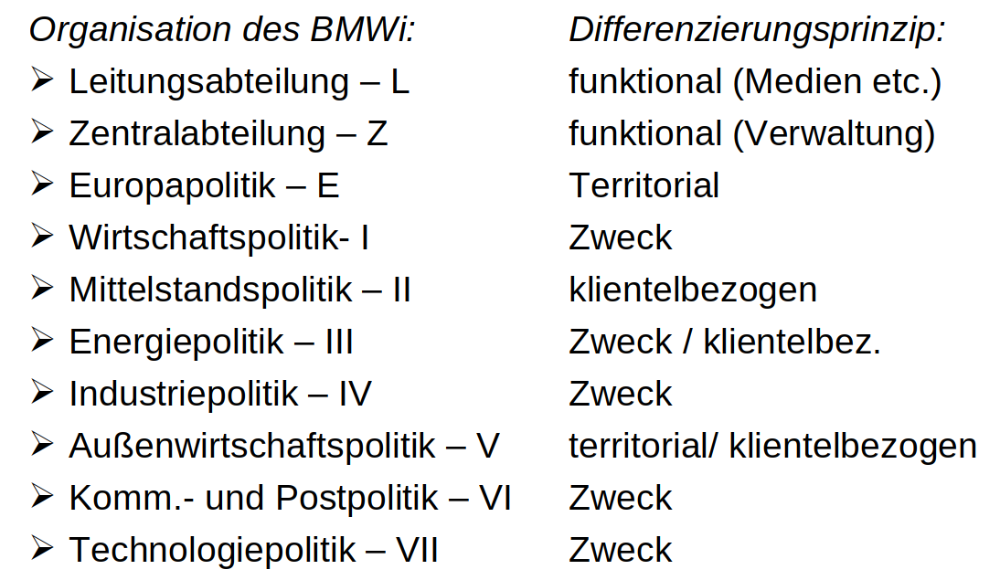

# 5. Sitzung: Formen des Verwaltungshandelns
## Was sind die Kernmerkmale einer bürokratischen Arbeitsweise?
Bürokratiemerkmale nach Max Weber:
- **Organisation** (strukturell)
  - hierarchische & *monokratische* Leitung (kein Kollegialprinzip) -> zählt zu Kernelelementen
  - räumliche & sachliche Kompetenzzuweisung (klare Zuständigkeiten)
    - funktioniert gut in DE: eher Streitigkeiten zw Ministerien (aufrgrund versch. Interessen/Perspektiven + Zuständigkeitskonflikte) als Behörden
  - Regelgebundenheit & Unpersönlichkeit (Entscheidung ohne "Ansehen der Person")
    - Unpersönlichkeit im Außenkontakt, nicht innerhalb
  - Schriftlichkeit & Aktenkundigkeit aller Vorgänge (Kontrolle + Nachvollziehbarkeit)
    - problematisch -> elektr. Akte
  - Trennung von Haushalt & Betrieb (kein Eigentum an Verwaltungsmitteln)
    - Arbeitsmittel werden bereitgestellt
- **Personal**
  - nur Hauptamtlichkeit (kein Neben- oder Ehrenamt)
  - Meritokratie 
    - Position nach Verdienst/Leistung = formale Qualifikation als Einstellungsvoraussetzung (keine Laien- oder Dilettantenverwaltung)
    - Einstellung & Beförderung nach Qualifikation (nicht gemäß sozialer Herkunft)
    - Ernennung (keine Vererbung/Käuflichkeit von Ämtern)
      - Korruption in DE gering
  - feste Besoldung (keine Bezahlung durch "Kunden")
  - Amtsethos & Disziplin (Binnenorientierung)
    - zweifelhaft da nicht immer schnell/kundenfreundlich
  - Parteipolitisierung der Verwaltung sinkend

## Was lässt sich aus den Kernmerkmalen der Verwaltung hinsichtlich ihrer Arbeitsweise folgern?
recht hohe Berechenbarkeit -> wenig überraschend
- Selbstbindung (Ausnahmen nur mit Begründung)
- Gerichtsfestigkeit (Frage ob Handeln vor Gericht vertretbar wäre)

fachliche Expertise
- Einstellung nach Qualifikation
- Abnahme des Juristenanteils

Neutralität -> vollzieht den Willen des Gesetzgebers

eindeutige Verantwortlichkeiten (wegen fester Zuständigkeiten)

Loyalität (Treueeid auf den Dienstherrn)

## Was sind die Grundprinzipien der *Kommunalverwaltung*?
- Selbstverwaltung, Rechts- und Fachaufsicht des Landes
- Bürgermeister leitet kommunale Verwaltung
  - Geschäftskreis wird durch Bürgermeister festgelegt
- Beigeordnete/Dezernenten(=kommunale Wahlbeamte) leiten Ämter/Fachbereiche/Dezernate
- Rat der Gemeinde entscheidet über "politische Grundsätze"/Selbstverwaltungsaufgaben (genauer: freiwillige Aufgaben, Pflichtaufgaben ohne Weisung) -> siehe andere Sitzung

## Was sind die Grundprinzipien der (nichtministeriellen) *Bundes-/Landesverwaltung*?
- Präsident(wird ernannt) besitzt die Geschäftsleitungsgewalt
- Aufgaben sind *gesetzlich festgelegt*, aber häufig Beurteilungspielräume bei Ausführung
- steht unter Rechts- und Fachaufsicht (komm. Verwaltung zwar auch aber anders & nicht bei allen Aufgaben)
- Organisation ist ähnlich wie in Ministerien:
  - Leitung, Abteilungen, Referate/Fachbereiche
- monokratische Leitung, hierarchisch

## Wie sieht die Aufbauorganisation der Verwaltung in der Praxis aus?
Man kann den Aufbau innerhalb von Behörden (intra-organisatorisch) und zwischen von Behörden (inter-organisatorisch) entlang einer vertikalen und horizontalen Ebene unterscheiden:

|            | Inter-organisatorisch                                           | Intra-organisatorisch              |
|------------|-----------------------------------------------------------------|------------------------------------|
| horizontal | Ministerien, Behörden, Ämter                                    | Abteilungen, Referate, Sachgebiete |
| vertikal   | dezentrale Behördenteile (Außenstellen), nachgeordnete Behörden | Unterabteilungen (Stäbe)           |

Differenzierungsprinzipien:
- gegliedert werden intra-organisatorische Bereiche in der Praxis hauptsächlich nach Zweck & Funktion:
  - Zweck:
    - ähnliche Aufgaben: zB Bildung, Kriminalitätsbekämpfung, Wirtschaftsförderung
  - funktionale Organisation:
    - Ingenieure, Ärzte, Geographen
  - klientelorientierte Organisation:
    - Bauern, Bergbau, Jugend
  - territoriale Organisation:
    - nach geographischer Zuständigkeit

## Wie gestaltet sich die Ablauforganisation der Verwaltung?
Ablauforganisation: Verfahren
- Abläufe & Verfahren sind an Regeln gebunded (Regelgebundenheit, festgelegte Verfahren)
- Geschäftsordnung und Geschäftsverteilungsplan definieren die Zuständigkeitsverteilung
- Dienstweg (vertikaler u. horizontaler Weg)
- Koordination (Verhaltensabstimmung) -> wer macht wann was?
  - intern: Federführung, Mitzeichnung, Kenntnisnahme
  - extern: Ressortzuschnitt, (De)Zentralisierung, Veto-Punkte

Ablauforganisation: Probleme und Lösungswege
- selektive Perzeption (= begrenzte Aufmerksamkeit)
- positive(weniger) und negative(dominant) Koordination
  - positive Koordination = Abstimmung zwischen Organisationseinheiten, inkl Prüfung aller Kombinationsmöglichkeiten die für beteiligten den höchsten Nutzen generiert(aufwändig)
  - negative Koordination = Abstimmung zw Organisationseinheiten, wo lediglich geprüft wird ob Entscheidungsveriante einen negativen Einfluss haben könnte, aber keine Prüfung möglicher optimaler Kombinationen, selektive Weitergabe von Informationen, nur soviel wie nötig
- Konfliktlösung durch Hochzonung
  - Problem: Überlastung der Leitung, Problemabschiebung als Problemlösung?!
- Route als Problem (evtl. Betriebsblindheit)
  - Gegenmittel: Aufgabenzuschnitt, Personalrotation
- Vordringlichkeit des Befristeten (Luhmann)
- Defensivhandeln aufgrund:
  - drohender Gerichtsklagen
  - demotivierender Kontrollen
  - interner Einflussverluste
