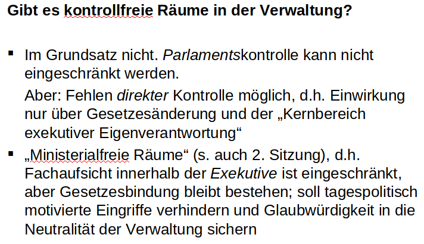

# 10. Sitzung: Kontrolle der Verwaltung
## 9.1 Begründung + Begriffserklärung
Warum Verwaltungskontrolle?
- Demokratieprinzip: alles staatliche Handeln unterliegt dem Parlamentseinfluss ("Gesetzgeberwille")
- soll Zweckmäßigkeit und Wirtschaftlichkeit sichern

Was heißt Kontrolle und wie grenzt sie sich ggü anderer Verfahren ab?
- Soll/Ist-Vergleich durch externe Kontrollinstanz, aber interne Aufsicht als Kontrollinstrument

Kontrolle:
- *nachherige*(ex post) Überprüfung einer Tat auf ihre Übereinstimmung mit Vorgaben
- Vergleich eines Soll- und Istwerts
- Messung des Abstandes der Wirklichkeit von vorgegebenen Zielen (keine weitergehende Optimierung)
- Kontrollverfahren, das mit einer Kontrollentscheidung endet
- Abgrenzung zu anderen Verfahren:

|                  | Steuerung                  | Kontrolle           | Aufsicht                           |
|------------------|----------------------------|---------------------|------------------------------------|
| Ziel             | inhaltliche Programmierung | Soll/Ist-Vergleich  | Soll/Ist-Vergleich + Nachsteuerung |
| Wirkungszeitraum | Ex-ante + ex-post          | Ex-ante             | Ex-ante + ex-post                  |
| Akteure          | Politik/Verwaltung         | Externe, zB BT, BRH | Verwaltung                         |

Was wird kontrolliert?
- Zweckmäßigkeit
- Effizienz bzw Wirtschaftlichkeit
  - Bewertung der Zielerreichung im Verhältnis zu den eingesetzten Mitteln
- Erfolg bzw Wirkung
  - Prüfung ob ein bestimmtes Ziel erreicht wurde (Programm-Evaluierung)

## 9.2 Instrumente der Verwaltungskontrolle
vier Instrumente der Verwaltungskontrolle:

### 9.2.1 Gerichtliche Kontrolle
- jeder der durch öffentliche Gewalt in seinen Rechten verletzt wird, hat das Recht ein Gericht anzurufen (Rechtsschutz)
  - dieser Rechtsschutz bezieht sich auf Rechtmäßigkeit von Verwaltungsentscheidungen, nicht jedoch auf deren Zweckmäßigkeit
- Rechtsschutz gg die Verwaltung wird im jeweils zuständigen Rechtszweig gewährt (Verwaltungsgerichte, Finanzgerichte, Sozialgerichte)

### 9.2.2 Finanz- und Haushaltskontrolle
- durch Rechnungshöfe (des Bundes oder der Länder)
  - nur dem Gesetz unterworfen
  - richtleriche Unabhängigkeit + nicht absetzbar
- Kontrollauftrag der Rechnungshöfe gilt der gesamten finanziellen Betätigung des Staates
- zusätzlich Kontrolle der Regierung durch Haushaltsausschuss des Bundestages

### 9.2.3 Politische Kontrolle der Verwaltung
- kann *unmittelbar* durch Bürger, NGOs, öffentliche Meinung, Verbände oder Medien und *mittelbar* durch Repräsentanten ausgeübt werden

### 9.2.4 Interne/administrative Kontrolle
- findet als Rechts-/Fachaufsicht zw Behörden statt
- *Rechtsaufsicht* soll Rechtmäßigkeit (auch in Verfahren) des Verwaltungshandelns sichern, findet verwaltungsintern statt und umfasst auch Korrekturen
- *Fachaufsicht* soll Zweckmäßigkeit des Verwaltungshandelns sichern (inkl Wirtschaftlichkeit), kann in pol Richtungssteuerung des Vollzugs übergehen
- *Dienstaufsicht* findet innerhalb einer Behörde statt

