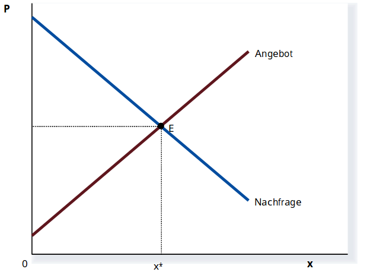
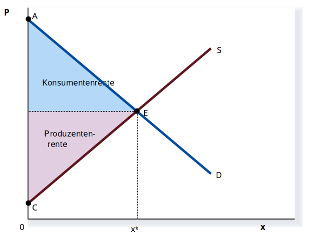
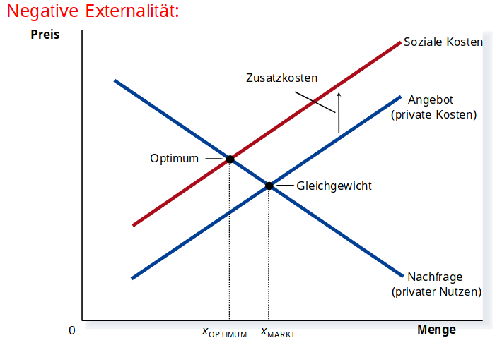
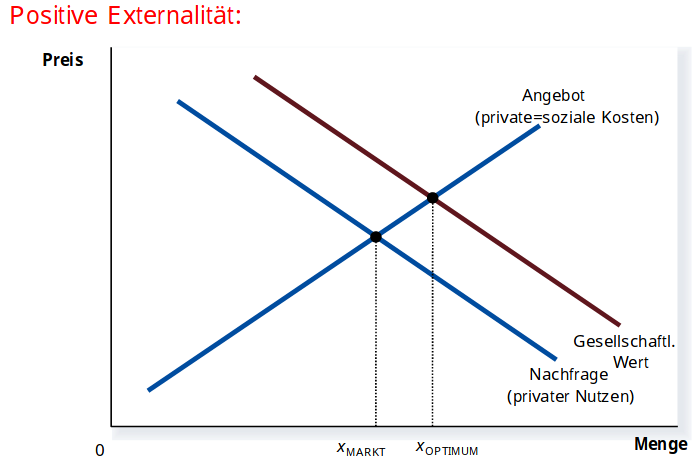
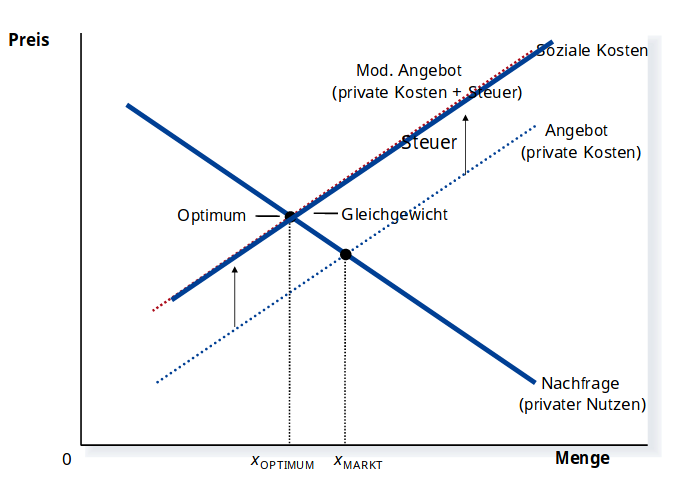
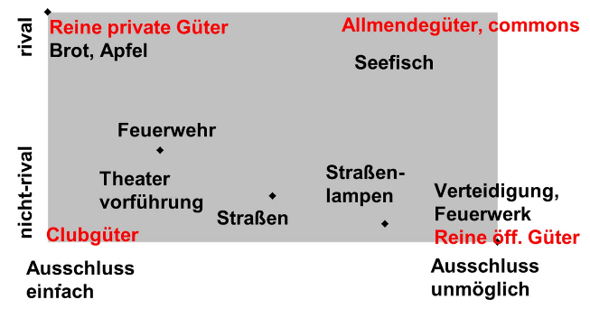

# 2. Wirtschaftspolitik und Marktwirtschaft: Allokationsprobleme
## 2.1 Märkte und ihre Effizienzeigenschaften
Markt = Zusammentreffen von Angebot und Nachfrage

dezentraler Allokationsmechanismus:
- jeder Anbieter bietet freiwillig an
- jeder Nachfrager fragt freiwillig nach
- Koordination erfolgt ohne Eingriffe von außen
=> Wie kann etwas das so "unorganisiert" ist funktionieren und auch noch ein gutes Ergebnis hervorbringen?

Marktgleichgewicht

Eigenschaften des Marktgleichgewichts:
- die einzige Konstellation, in der die Pläner aller Beteiligten miteinander kompatibel sind (Koordinationsfunktion von Preisen)
- diejenige Konstellation, bei der die größtmögliche Menge gehandelt wird
  - maximiert die Summe realisierbarer Tauschvorteile
- Effizienz: im MarktGG ist die Summe aus Konsumentenrente und Produzentenrente maximal
  - bei jeder anderen Konstellation ist Summe aus KR und PR geringer

Konsumentenrente = Zahlungsbereitschaft der Konsumenten (=Wert für die Nachfrager) - tatsächliche Zahlung

Produzentenrente = tatsächliche Zahlung - Gesamtkosten des Angebots

ergo Konsumentenrente + Produzentenrente = Wert für Nachfrager - Kosten des Angebots = Nutzen-Kosten Differenz 

Politikimplikation: wenn Märkte effizient sind, gibt es keinen allokativen Rechtfertigungsgrund für Staatseingriffe -> *laissez-faire*

**Marktversagen** = Allokation auf Märkten führt nicht zu Effizienz (d.h maximiert nicht die Differenz aus volkswirtschl. Nutzen und Kosten)

## 2.2 Externalitäten und Lösungsversuche
Externe Effekte = Tätigkeit eines Akteurs beeinflusst den Nutzen anderer Akteure vorteilhaft oder nachteilig, ohne dass hierfür Kompensatin erfolgt oder dass dies in Marktpreisen erfasst wird
  - allgemein: **private** Grenznutzen und/pder Grenzkosten stimmen nicht mit gesellschaftlichen (**sozialen**) Grenznutzen bzw Grenzkosten überein

- bei neg. Externalitäten kommt es auf dem Markt zu einer Überversorgung
- *Optimum* liegt dort wo zusätzlicher Nutzen einer weiteren Einheit den gesellschaftlichen Kosten ihrer Produktion entspricht
- *Marktgleichgewicht* liegt dort wo zusätzlicher Nutzen einer weiteren Einheitden privaten Kosten ihrer Produktion entspricht
- da soziale Kosten bei negativen Externalitäten über den privaten Kosten liegen, kommt es zu einer Überversorgung
- **Marktversagen** da MarktGG != Optimum (ineffizent)
- Markt maximiert immernoch Summe aus KR und PR

- bei pos. Externalitäten kommt es auf dem Markt zu einer Unterversorgung (relativ zum  Optimum)

### 2.2.1 Steuern oder Subventionen zur Korrektur von Marktversagen
Artur C. Pigou: private & soziale Grenznutzen bzw Grenzkosten können durch korrigierende Steuern & Subventionen angeglichen werden
- Ansatzpunkte der *Pigou-Lösung* sind alle Determinanten von Angebot und Nachfrage (zB Öko-, Mineralöl-, Kfz-Steuer)

zB korrigierende Steuer bei negativen Externalitäten:

### 2.2.2 Haftungsrecht
Ansatz: umfassende & jederzeit durchsetzbare Haftungsregeln, die auf dem Verursacherprinzip aufbauen, würden die Externalitäten beseitigen

Anreize zur frühzeitigen Schadenverhinderung schaffen (zB Umwelthaftungsrecht)

**Prinzip der Gefährdungshaftung**: generelle Ersatzpflicht für alle Schäden

**Prinzip der Verschuldenshaftung**: Ersatzpflicht fällt nicht an, wenn der Schaden weder vorsätzlich noch fahrlässig herbeigeführt wurde

### 2.2.3 Handelbare Schädigungsrechte (Zertifikate)
Schädiger erhalten handelbare Eigentumsrechte am Gut "Umweltverschmutzung"
- können Zertifikate hinzukaufen oder verkaufen

Preisentwicklung der Zertifikate ist Instrument zur Förderung & Lenkung von Innovation

Voraussetzung: Markt für Zertifikate ist Konkurrenzmarkt

Beispiel: Emissionshandel (zuerst in den USA nach dem Clean Air Act [1990])

### 2.2.4 Internalisierung externer Effekte durch Verhandlungen
Externalität ist immer zweiseitig

Ronald Coase: effiziente Internalisierung allein durch private Verhandlungen zwischen den Betroffenen gegeben

rationale Individuen lassen mögliche Pareto-Verbesserungen nicht brachliegen
- zB: Nichtraucher kauft Raucher das Recht zu rauchen ab *oder* Raucher kauft Nichtraucher das Recht auf saubere Luft ab

*Coase-Lösung* ist unabhängig von der Verteilung der Haftungsrechte, die Rechte müssen nur eindeutig zugeordnet sein

**Coase Theorem** = in einer Ökonomie mit vollständig zugewiesenen Eigentumsrechten und ohne Transaktionskosten ist ein Marktgleichgewicht effizient
- Ursache für externe Effekte daher:
  - unvollständige Eigentumsrechte 
  - Transaktionskosten

## 2.3 Öffentliche Güter
öffentliches Gut = gemeinsam konsumierbares Gut
- Nutzung des Gutes durch einen weiteren Akteur beeinflusst nicht den (Konsum-)Nutzen anderer Akteure
  - zB Infrastruktur, Vorlesung, Kino, Theater, Umweltgüter, TV-Programm
- Achtung: öffentliches Gut heißt nicht direkt staatlich bereitgestelltes Gut
- öffentliche Güter können *übernutzbar* sein

Arten von Gütern

### 2.3.1 Effiziente Bereitstellung (Nutzen-Kosten-Kalkül)
h = 1, ..., H: Personen in der Gesellschaft

Eine weitere Einheit des öffentlichen Gutes:
- ... bringt Person h einen zusätzlichen Nutzen im Wert von **GZBh** 

