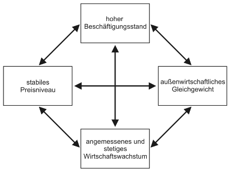

# 3. Gesellschaftliche Ziele und kollektive Entscheidungen
## 3.1 Wirtschaftspolitische Ziele
methodischer Individualismus impliziert, dass Ziele (=Gruppenpräferenzen) sich aus individuellen Zielen ableiten lassen müssen

Beispiel: Magisches Viereck (Ziele bilden zusammen das gesamtwirtschaftliche Gleichgewicht)

Vollbeschäftigung, weil:
- effizient, ansonsten brachliegende Produktionskapazitäten
- gerechtere Verteilung, da Arbeitslose ansonsten kein/geringes Einkommen
- aus gesellschaftspolitischer Sicht erfolgt Teilhabe am sozialen Leben über Arbeit

Preisstabilität, weil:
- effizient, weil es Planungssicherheit gibt
- gerechte Verteilung, da ansonsten eine Inflation zu Lasten von Gläubiger/Beziehern nominell fixierter Einkommen gehen würde
- eine Deflation würde den Realwert der Kassenhaltung erhöhen & Investitionen mindern

ZB-Ausgleich (außenwirt. Gleichgewicht), weil:
- ein Leistungsbilanz-Ungleichgewicht würde auf Gütermarkt-Ungleichgewicht hindeuten
- Zahlungsbilanz-Ungleichgewicht = Ungleichgewicht der Devisenbilanz

Wirtschaftswachstum, weil:
- Unbegrenzheit der Bedürfnisse (mehr ist besser)
- größeres BSP erleichtert Umverteilung

## 3.2 Soziale Wohlfahrt & Probleme der Präferenzaggregation
Wie kann man aus individuellen Präferenzen eine Gruppenpräferenz / Gruppenentscheidung ableiten?
- KER = Kollektive Entscheidungsregel
  - eine KER ermittelt für jedes Profil individueller Präferenzen eine Gruppenpräferenz zwischen je zwei Alternativen

### 3.2.1 Social Choice

### 3.2.2 Mehrheitsregeln
Grundidee der Demokratie: wenn X mehr Stimmen bekommt als Y, dann zieht die Gruppe X ggü Y vor

MR produziert "Zyklen" (sog. Condorcet Paradox)

Gruppenpräferenz der MR ist keine *Ordnung*

es gibt oft keinen Condorcet Sieger, d.h eine Alternative die jeden paarweisen MR-Vergleich gewinnt
- kein Problem bei nur zwei Alternativen, aber was ist die beste Alternative bei mehr als zwei Alternativen?

wer über die Tagesordnung entscheidet, bestimmt über das Ergebnis
- Chaos Theorem: wenn es keinen Condorcet-Gewinner gibt, so kann jeder (nicht-dominierte) Alternative bei geeigneter Wahl der Tagesordnung als Sieger aus sequentiellen Abstimmungen hervorgehen

gilt die *value restriction*, so kommt es bei MR nicht zu Zyklen
- *value restriction* = Präferenzen sind nicht "zu verschieden" (Homogenität)

### 3.2.3 Binäre Unabhängigkeit
Gruppenpräferenz zwischen je zwei Alternativen soll nicht von der Bewertung dritter, "irrelevanter" Alternativen abhängen

Informatorische Sparsamkeit

Verletzung von binärer Unabhängigkeit impliziert:
- Manipulation durch "Klone"
- KER ist anfällig für strategisches Verhalten ("Lügen")
- KER ist nicht monoton

### 3.2.4 Arrows Unmöglichkeitstheorem
Fragen:
- Welche Eigenschaften sollte eine vernünftige KER erfüllen?
- Welche KERn besitzen dann diese Eigenschaften?

Geforderte Eigenschaften (Axiome):
- Unbeschränkter Definitionsbereich [UD]
  - alle individuellen Präferenzordnungen und deren Kombinationen sind zugelassen
- (schwaches) Pareto-Prinzip [P]
  - wenn jedes Mitglied einer Gruppe *x* besser findet als *y* dann soll ergo auch die Gruppe *x* besser finden als *y* (Einstimmigkeitsprinzip)
- Ordnung [O]
  - die KER liefert immer eine vollständige & transitive Rangfolge der Alternativen
- Binäre Unabhängigkeit [BI]

Arrows Theorem: *Wenn es drei oder mehr Alternativen gibt, so erfüllt eine KER die Axiome [UD], [P], [O], [BI] genau dann, wenn sie eine Diktator-Regel ist*
  - Diktator-Regel: es gibt ein Individuum h in G, so dass die Gruppenpräferenz immer mit der Präferenzordnung dieses Individuums übereinstimmt
    - h aus G: [ x >h y -> x > G y]

keine akzeptable KER erfüllt alle Axiome
- jede KER hat irgendwelche "Pferdefüße", es gibt kein ideales Verfahren
- paradoxe Ausgänge von Entscheidungssituationen lassen sich nicht vermeiden
- Beweis: mehrere Ansätze
- Intuition: [O] und [BI] stehen wohmöglich in Widerspruch zueinander
- alle Gemeinwohlvorstellungen bleiben als Gruppenpräferenz fragwürdig

## 3.3 Gerechtigkeit, Gleichheit, Verteilung
Herstellung von Gerechtigkeit ist eine Motivation für "Sozialpolitik" und für Wirtschaftspolitik allgemein
- Dominanz der distributiven Perspektive in der wirtschaftspolitischen Debatte

Lorenzkurve
- Lorenzkurve einer Verteilung zeigt an, welchen Prozentsatz des gesamten Einkommens die ärmsten 100 h:H Prozent der Haushalte erhalten
- Interpretation: je näher die Lorenzkurve an der 45°-Linie, desto gleichmäßiger ist die Verteilung

(Einkommens-)Gleichheit
- operationalisierbares (statistisches) Konzept
- Reduktion von Ungleichheit und  Gerechtigkeitsverbesserung u.U. äquivalent (Atkinson-Theorem)
- in D wirkt Wirtschaftspolitik tendenziell egalisierend (ausgleichend)
