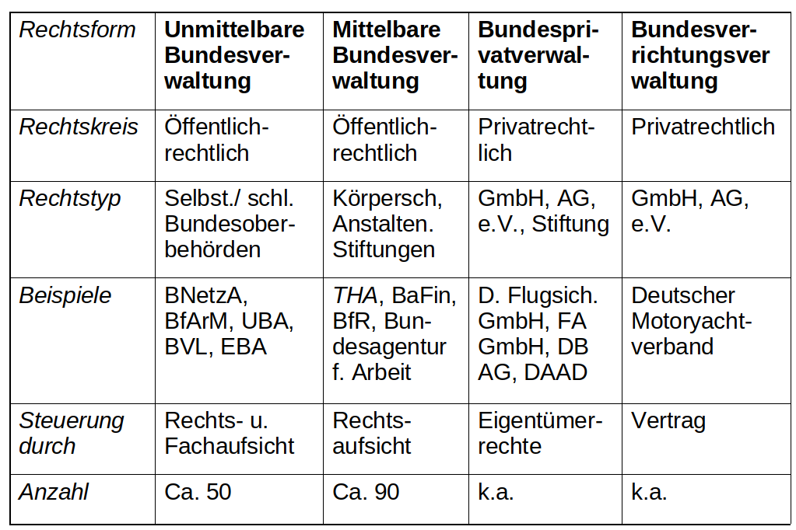

# 3. Sitzung: Strukturen - Verwaltungsaufbau und Aufgabenverteilung im föderativen System
## Mögliche Klausurfragen
### Wie gestaltet sich die Aufgabenverteilung im Bundesstaat (Vergleich Bundes- und Länderebene)?
Gesetzgebung
- der Bund besitzt die Mehrheit der Gesetzgebungskompetenzen
- Länder haben wenige eigene Gesetzgebungskompetenzen
  - allerdings in einigen prominenten Bereichen wie Bildung, Kultur, Polizei (kann genutzt werden um Wähler zu gewinnen)

Verwaltung
- wenige eigne Verwaltungskompetenzen auf Bundesebene (aber Rechtsaufsicht) + Bundesbehörden
- mehrheitliche Verwaltungskompetenzen befinden sich auf Länderebene + Landesbehörden
  - umschließen Länder und Kommunalebene
- Behörde entweder mittelbar oder unmittelbar

Rechtssprechung
- 5 Bundesgerichte (Oberste Gerichte) vs Landesgerichte

### Beschreiben Sie die Verwaltung auf Bundesebene und ihren Aufbau
Bundesministerien:
- Errichtung teilw. im GG geregelt, aber meist Organisationserlass
- hierarchisch aufgebaut
- werden monokratisch geleitet (Minister, Staatssekretäre)
- werden grundsätzlich in Referate & Abteilungen aufgeteilt
  - es gibt Mindestgrößen

Nichtministerielle Bundesverwaltungen:
- es gibt unterschiedliche Rechtsformen
- Errichtung aufgrund von Gesetzen, Verordnungen, Beschlüssen der Regierung etc
- sind überwiegend hierarchisch aufgebaut (selten kollegial)
- werden ebenfall monokratisch geleitet (Präsident, Direktor)
- Geschäftsordnung regelt Organisation (selten durch das Gesetz geregelt)
- Aufgaben u.a. Wettbewerbsrecht (Bundeskartellamt), Telekommunikation, Energiereguliertung (Bundesnetzagentur/ BMWi)

(von links nach rechts abnehmend staatlich organisiert o staatsgeleitetes Handeln)

### Beschreiben Sie die Verwaltung auf Landesebene und ihren Aufbau
Landesverwaltung beschäftigt ca 50% aller Personen im ÖD:
- Aufgaben:
  - Erarbeitung von Landesgesetzen durch Landesministerien
  - Vollzug von Landesgesetzen durch Landesbehörden
  - Vollzug von Bundesgesetzen durch Landesbehörden als „eigene Angelegenheit“ ist der Normalfall
    - alternativ: Auftragsverwaltung (Art. 85 GG) unter Aufsicht des Bundes (Bundesfernstraßen, Atomgesetz)
      - aber eher selten
- Organisation (zwei- oder dreistufig):
  - oberste Landesbehörden (Landesministerien, Landesrechnungshöfe)
  - obere Landesbehörden (ua Verfassungsschutz, Landesumweltamt)
  - mittlere Landesbehörden
  - untere Landesbehörden (zB Straßenbauamt)

### Beschreiben Sie die Kommunalverwaltung und ihren Aufbau
eigene Verwaltungsebene, aber staatsrechtlich Teil der Länder
- kommunale Selbstverwaltung vs kommunale Demokratie
  - keine Demokratie, weil Rechts- & Fachaufsicht über den gewählten Organen (Bürgermeister, Rat) steht
- Länder regeln Kommunalverfassung per Gesetz und führen Aufsicht

Selbstverwaltungsrechte:
- Satzungs-, Personal-, Finanz- und Organisationshoheit

Aufgaben:
- *Auftragsangelegenheiten*(übertragener Wirkungskreis) = vom Land per Gesetz geregelt, keine Spielräume (zB Lebensmittelüberwachung)
- *Selbstverwaltungsangelegenheiten*(eigener Wirkungskreis) = Angelegenheiten bei denen Gemeinde selbst mit entscheiden kann
  - Freiwillige Aufgaben (ohne Weisung) = bietet Sparpotential da nicht verpflichtend zB Theater, Museen
  - Pflichtaufgaben (ohne/nach Weisung) = werden vom Land überwacht zB Gemeindestraßen, Abfallbeseitigung, Schulverwaltung

Staatsaufsicht über Kommunalverwaltung:
- zuständig meist Kommunalabteilung im Innenministeriung oder Regierungspräsidien als Mittelinstanz
- **Rechtsaufsicht** bei freiwilligen und Pflichtaufgaben *ohne Weisung*
- **Fachaufsicht** bei Auftragsangelegenheiten und Pflichtaufgaben *nach Weisung*
- Aufsicht erfolgt meist als "Beratungsaufsicht"
  - es gilt das Übermaßverbot
- Instrumente:
  - Informations-, Beanstandungs-, Anordnungsrecht, Ersatzvornahme (Aufsicht tritt anstelle der Kommune)
  - Genehmigungsvorbehalte
  - Haushaltssicherungsverfahren (zunehmend wichtiger)
    - Berater/Staatsbeauftrager der zur Kosteneinsparung Gemeinderat auflösen o Amtszeit des Bürgermeisters vorzeitig beenden kann
- Kommunen können anders als Bundes- und Landesbehörden gegen Aufsichtsmaßnahmen klagen

