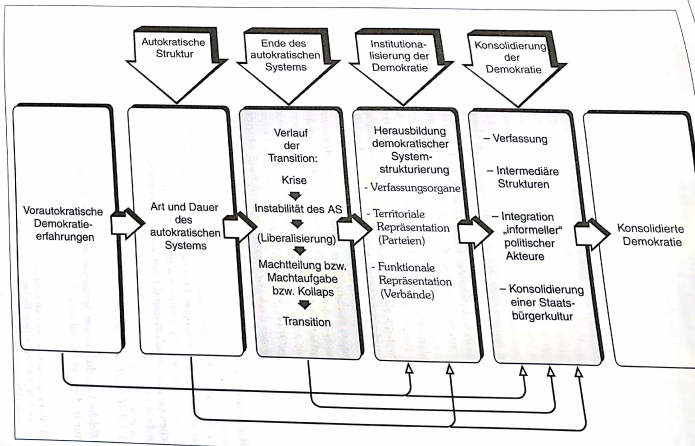
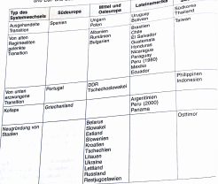
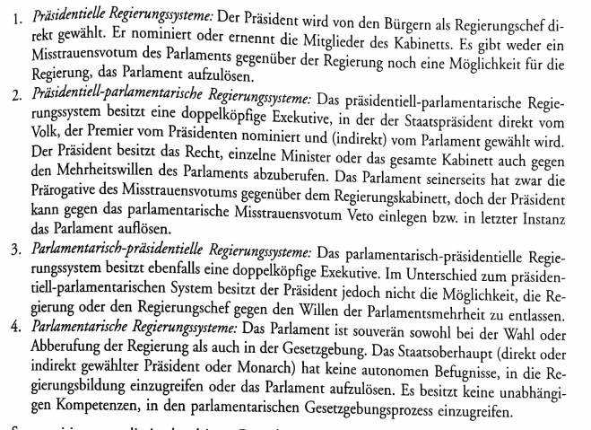
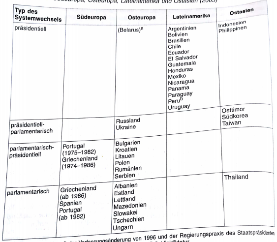

# 3. Transformationsphasen
O'Donnel & Schmitter haben Phasen des Systemwechsels von Autokratie zu Demokratie am klarsten herausgearbeitet
- allerdings orientiert an Transitionsprozessen in Südeuropa & Lateinamerika
  - häufig Einleitung von den alten Regimen, was bei Systemtransformationen nicht immer der Fall ist

Idealtypischer Wechsel von autokratischen System zur Demokratie:

Systemwechsel = Intervall zw einem alten & einen neuen pol System
- beinhaltet Auflösung der alten & Aufbau einer neuen pol Herrschaftsstruktur
- grundlegende Strukturen, Funktionen & Integrationsmechanismen werden ersetzt
  - zunächst erhebliche *Ent*differenzierung ("Auflösung") der alten Institutionen & anschließende *Re*differenzierung ("Aufbau")

Wechsel von Autokratie zu Demokratie ist nach zwei Seiten hin abgegrenzt
- erste Abgrenzung kennzeichnet Beginn der Auflösung des alten autoritären/totalitären System
- zweite Abgrenzung wird vom neu etablierten demokr. System markiert
- dazwischen legen drei Phasen des eigentlichen Systemwechsels
  - Ende des autokratischen Regimes
  - Institutionalisierung der Demokratie
  - Konsolidierung der Demokratie

## 3.1 Ende des autokratischen Systems
es ist zu unterscheiden zwischen den Ursachen und den Verlaufsformen des Endes von autokratischen Systemen

### 3.1.1 Ursachenkomplexe
welche Ursachen Systemwechsel zugrunde liegen, kann für jede Systemtransformation nur in der jeweils konkreten Analyse erforscht werden
- allerdings bisher schon soviele unterschiedliche Transformationen untersucht worden, so dass sich einige allgemeine Aussagen über Ursachenbündel & typische Verknüpfungsmuster von Ursachen treffen lassen
  - daraus kann man wiederum Hypothesen gewinnen, die konkrete Fallanalysen theorieorientiert leiten

Kombinationen von strukturellen, sozialen, politischen, ökonomischen Ursachen variieren in Anzahl, Art und Bedeutung der beteiligten Akteure & ihrer Handlungen
- deshalb immer konkrete Analyse des Ineinandergreifens von strukturellen Veränderungen & pol Handlungen von Nöten (Interdependenzen)

Stukturen & Handlungen sind die beiden fundamentalen Dimensionen, die in Analysen des Zusammenbruchs autokratischer Systeme wie auch des gesamten Systemwechsels aufeinander bezogen werden müssen
- Strukturen bestimmten Handlungskorridor, innerhalb dessen unterschiedliche Akteure versuchen, ihre Interessen mit geeigneten Handlungsstrategien durchzusetzen
  - erfolgreiche Aktionen können Handlungskorridor verbreitern & zusätzliche Handlungsoptionen ermöglichen
  - Stukturen sind nicht unbedingt nur Handlungsoptionen, sondern unter Umständen auch Handlungsressourcen

es kann systematisch zw systeminternen & systemexternen Faktoren unterschieden werden
- diese Faktoren lösen bestimmte Reaktionen bei autokratischen Eliten und der Regimeopposition aus die zum Ende eines autokr. Systems führen können

### 3.1.2 Systeminterne Ursachen
#### 3.1.2.1 Legitimitätskrise aufgrund ökonomischer Ineffizienz
autokr. Systeme sind aufgrund des umfangreichen Herrschaftsanspruch der regierenden Eliten, des Herrschaftsausschlusses großer Teile der Bevölkerung, sowie der repressiven Herrschaftsweise, mit einem *ständigen systembedingten Legitimitätsdefizit* behaftet
- zum Ausgleich erscheint vielen autoritären bzw totalitären Regimen die wirtschaftl Modernisierung als ein vergleichsweise risikoarmer Weg, um die Bevölkerung für ihre pol. Entmündung zu entschädigen

scheitert die wirtschaftl Modernisierung, so geraten diese "Entwicklungsdiktaturen ohne Entwicklung" in eine gefährliche Legitimitätskrise
- insbesonders dann wenn sich massiver gesellschaftlicher Protest formiert
  - und sich herrschende Eliten an der Frage spalten, ob sie diesem Protest mit verstärkter Repression oder vorsichtiger pol Liberalisierung begegnen sollen
  - jede Reaktion des Regimes ist mit unvorhersehbaren Risiken für Sicherung ihrer autokr Herrschaft verbunden

#### 3.1.2.2 Legitimitätskrise aufgrund ökonomischer Effizienz
Modernisierungstheorie + Lateinamerikaforschung haben auf eigentümliche Ambivalenz von Modernisierungsprozessen in autokratischen Systemen hingewiesen

Auch Erfolg der sozioökonomischen Modernisierung kann zur Krise & zum Ende autoritärer oder totalitärer Herrschaft führen

theoretisch plausible & empirisch häufig bestätigte modernisierungstheoretische Argumentation lautet folgendermaßen:
- gelingt die Modernisierungsstrategie (Wirtschaft wächst, Konsum- + Bildungsniveau steigen, sektorale Wirtschaftsstruktur verschiebt sich vom Agrar- zum Dienstleistungs- und Industriesektor) führt dies zu erheblichen Veränderungen der Sozialstruktur
  - Einfluss der reaktionären Großgrundbesitzer geht zurück
  - große Teile der einer parochialen pol Kultur anhängenden und politisch passiven Landbevölkerung werden schrittweise "wegmodernisiert"
  - starkes Anwachsen des städtischen Industrieproletariats und Herausbildung gut ausgebildeter & selbstbewusster Mittelschichten
  - diese beiden Klassen fordern mehr pol Mitsprache, verbesserte gesellschaftliche Aufstiegschancen und gerechtere Verteilung des volkswirtschaftl Ertrages
- vormoderne passiv-resignative Loyalität ggü dem autoritären Regime, weicht Forderungen nach pol & wirtschaftl Partizipation
  - eine soziale & pol Opposition entsteht
- diese nichtintendierten Effeke der Modernisierung, die zunächst ja nur die Legitimitätsreserven des autokr. Systems stärken sollen, können deshalb auch dessen Ende beschleunigen (bspw Spanien 1970er, Taiwan & Südkorea 1980er, Thailand & Indonesien 1990er)

#### 3.1.2.3 Legitimitätskrise aufgrund politischer Schlüsselereignisse
sowohl gescheiterte als auch erfolgreiche sozioökonomische Modernisierungsprozesse entwickeln besondere Sprengkraft, wenn sie mit pol Schlüsselereignissen zusammenfallen, bspw:
- Tod eines Diktators (Franco 1975)
- regimeinterne Elitenkonflikte (Südkorea 1980er)
- Häufung von Skandalen + Korruption
- Bekanntwerden von Mentschenrechtsverletzungen

solche pol Schlüsselereignisse entwickeln besonders dann dramatische Effekte, wenn sie gravierende latente Legitimationsprobleme treffen
- Zusammentreffen dieser Umstände bedeuet häufig den Anfang vom Ende des autokratischen Regimes

### 3.1.3 Systemexterne Ursachen
#### 3.1.3.1 Kriegsniederlage
Zwei Varianten nach Stepan:
- Zusammenbruch des autokr Regimes als Folger einer militärischen Niederlage gegen demokr Staaten
  - demokr Siegermächte leiten häufig (Re-)Demokratisierung ein + überwachen die Anfänge
- humanitäre Interventionen von Staatenkoalitionen als Angriffskriege gegen autokratische Regime
  - implizites o explizites Ziel über die humanitären Nothilfen hinaus ist die Einführung der Demokratie
  - Beseitigung der Dikatur führt allerdings nicht zwingend zur Demokratie

Dritte Variante nach Merkel:
- Niederlage autokratischer Besatzregime, was Weg für eine (Re-)Demokratisierung des besetzten Landes freimacht

#### 3.1.3.2 Wegfall externer Unterstützung
Wegfall einer wichtigen externen Unterstützung kann zentrale Ursache & notwendige Bedingung für Untergang eines autokratischen Systems sein

Entzug der Unterstützung autokratischer Herrschaftseliten kann wichtiger als die direkte Unterstützung demokr Oppositionsgruppen sein

#### 3.1.3.3 Dominoeffekt
Ende der südeuropäischen Rechtsdiktaturen (Mitter 1970er), Abdankung d Militärregime in Lateinamerika (Anfang 1980er), Zusammenbruch kommunistischer Systeme Osteuropas (nach 1989) lief in zeitlich konzentrierten regionalen Wellen ab

diese Ansteckungseffekte keine primären Ursachen für Ende autokratischer Herrschaftsordnungen, aber dennoch veritable "Verstärkungseffekte"

**Ursachen die Zusammenbruch eines autokratischen Herrschaftssystems herbeiführen, prägen in erheblichem Maße die Verlaufsformen der Ablösung des Regimes und des Beginns der Demokratiesierungsphase**

### 3.1.4 Verlaufsformen
sechs idealtypische Verlaufsformen für Ablösung autokratischer Systeme
- Realität: Mischformen

#### 3.1.4.1 Langdauernde Evolution
Demokratie setzt sich evolutionär, zeitlich gestreckt und nicht als Folge einer dramatischen historischen Zäsur durch

diese Verlaufsform des Systemwechsels beschränkt sich auf erste Demokratisierungswelle

#### 3.1.4.2 Von alten Regimen gelenkter Systemwechsel
Systemwechsel wird von den alten autokratischen Regimeeliten initiiert und kontrolliert

Regimeeliten bestimmen nicht nur auf welche Weise das autokr Regime abgelöst wird, sondern formen auch Strukturen des neuen demokr Systems
- Machtmitnahme teilweise für kurze Zeit möglich

Voraussetzung:
- Eliten nicht allzu diskreditiert
- Eliten haben weiterhin erhebliche Machtressourcen
- Regimeopposition vergleichsweise machtlos

wenn alte Eliten keine Militärs dann große Chance sich auch als pol Elite in neuer Demokratie zu etablieren

#### 3.1.4.3 Von unten erzwungener Systemwechsel
von unten erzwungene Systemwechsel, die nicht in Verhandlungen zw Regime- und Oppositionseliten münden, sind fast immer durch rasche Absetzung der autokratischen Machthaber gezeichnet

Voraussetzung:
- machtvoller Protest einer mobilisierten Öffentlichkeit
  - so dass Unterdrückung mit repressiver Gewalt wenig Erfolg verspricht

es folgt keine Machtteilung sondern Entmachtung alter Herrschaftsträger

#### 3.1.4.4 Ausgehandelter Systemwechsel
Wenn es zw Regimeeliten & Regimeopposition zu Pattsituation, setzen Verhandlungen über Herrschaftszugang, Herrschaftsanspruch und Herrschaftsweise ein
- eingangs unklar ob Opposition Demokratie durchsetzen kann
- evtl setzen sich Hardliner gegen Softliner des alten Regimes durch und stoppen Demokratisierung mittels Repression

#### 3.1.4.5 Regimekollaps
abrupter Zusammenbruch eines autokratischen Systems

im Unterschied zur Revolution keine "internen Akteure" verantwortlich
- vielmehr führen äußere Ursachen wie verlorene Kriege zu einem völligen Legitimitäts- und Machtverlust der herrschenden autokr. Eliten

Kollaps auch ohne direkte Außeneinwirkung möglich
- aufgrund latenter innnerer Legitimitätskrisen

#### 3.1.4.6 Zerfall und Neugründung von Staaten
autokratische Regime enden auch, wenn autoritäres o totalitäres Imperium zerfällt und neue Staaten entstehen die mit der Staatsgründung auch Chance auf demokratischen Neubeginn haben

## 3.2 Demokratisierung
### 3.2.1 Institutionalisierung der Demokratie
"Demokratisierung ist der Prozess in dem die unbegrenzte, unkontrollierte und kompromisslose eingesetze politische Macht von einer sozialen Gruppe oder Person auf institutionalisierte Verfahren verlagert wird, die die exekutive Macht begrenzen, laufend kontrollieren, regelmäßig verantwortbar machen und kontingente Ergebnisse ermöglichen" (Rüb)

entscheidener Schritt zur Demokratie ist also Übergang der pol Herrschaft von einer Person oder einer Gruppe auf ein "Set" institutionalisierter Regeln, die von allen anerkannt werden müssen

Demokratisierungsphase beginnt, wenn Kontrolle der politischen Entscheidungen den alten Herrschaftseliten entgleitet

Institutionalisierungsphase endet, wenn neue demokratische Verfassung verabschiedet ist und den pol Wettbewerb wie die pol Entscheidungsverfahren verbindlich normiert
- so gesehen ist Institutionalisierungsphase der Abschnitt innerhalb eines Systemwechsels, in dem die neuen demokr Institutionen etabliert werden
- Etappe in der alte Normen & Institutionen nicht mehr o tlw Geltung besitzen, während neue Normen & Institutionen noch nicht o tlw etabliert worden sind

### 3.2.2 Genese demokr Reigerungssysteme
Demokratische Regierungssysteme lassen sich anhand des Verhältnisses von Legislative zur Exekutive systematisch unterscheiden

systematisiert man die in der dritten Demokratisierungswelle entstandenen Regierungssysteme in die obige Typologie, so ergibt sich folgendes Bild:

Warum diese klaren Muster?
- zur Beantwortung vier Erklärungsansätze:

1. Historisch-konstitutioneller Ansatz
- Art & Gestalt der Verfassung als Ergebnis konkreter historisch-konstitutioneller Erfahrungen im eigenen Land und auf Grundlage der normativen Überzeugungen der Verfassungsgeber, sowie der soziokulturellen Besonderheiten des jeweiligen Landes erklärt
-> Lateinamerika

2. Prozessorientierter Ansatz
- es wird ein Zusammenhang des Systemwechselverlauf mit der konkreten Form des entstehenden Regierungssystems behauptet

3. Akteurstheoretischer Ansatz
- Verfassung und Form des Regierungssystems werden als Resultante rationaler Strategien & Handlungen von vor allem am eigenen Nutzen interessierter rationaler Akteure gedeutet

4. Import-Ansatz
- Verfassung und Regierungssystem werden vor allem nach dem Muster "erfolgreicher" Vorbilddemokratien geformt

### 3.2.2 Genese demokratischer Regierungssysteme (ab S.109)

Historisch-konstitutionelle Erklärungen für präsidentielle Regierungssysteme Lateinamerikas in Verbindung mit Import Ansatz am sinnvollsten
- in jenen Ländern in denen vor autoritären Regimen eine präsidentielle Demokratie bestand, wurden im Zuge der Redemokratisierung die Verfassungen mit wenigen Änderungen wieder in Kraft gesetzt
- Präsidentialismus am ehesten bevorzugt durch Eliten etc. in Lateinamerikas, weil am ehesten mit traditionellen Mustern der politischen Kultur und der Personalisierung der Herrschaftsformen übereinstimmen

Semipräsidentielle Regierungssysteme vor allem als typische Ergebnisse einer machtpolitischen Pattsituation gesehen werden in der weder altes Regime, noch demokratische Kräfte Verfassung allein bestimmen konnten
- alte Eliten sehen Macht am ehesten in Form von starkem Präsidenten gewahrt
- Demokraten für starke Parlament und von dessen Vertrauen die Regierung abhängt

Parlamentarische Regierungssysteme
- entstanden im Zuge der dritten Demokratisierungswelle, vor allem als Folge von Staatsneugründungen, in der demokratische Opposition dominierende Rolle spielt

Mit Verabschiedung der Verfassung endet die Demokratisierungsphase
- Demokratie nicht gesichert, jedoch größte Unsicherheit vorbei
- folgende Konsolidierungsprozess kann auf relative Sicherheit stützen

Phase demokratischer Konsolidierung
- demokratische Institutionen müssen innere Stabilität gewinnen und somit an gesamte politische System und Akteure Konsolidierungsimpulse abgeben

## 3.3 Konsolidierung
- demokratische Institutionen durch Verfassung oder Gesetze etabliert
- ersten freien Wahlen ("Gründungswahlen") als Beginn demokratischer Konsolidierung 
  - sinnvoller Verabschiedung einer Verfassung oder Revision alter Verfassung als Beginn wahrzunehmen
  - wichtigste Elemente etabliert, keine Normunsicherheit für Akteure

Wann Demokratie konsolidiert? 
- Demokratie: wenn R. Dahls 8 institutionelle und prozedurale Minima installiert sind
- Konsolidierung: G. Pridham Unterscheidung zwischen "negativer" und "positiver" Konsolidierung
  - Demokratien negativ konsolidiert, wenn kein relevanter Akteur außerhalb demokratischer Institutionen Interessen und Ziele verfolgt weil keine attraktive Alternative zur Demokratie existiert
  - Positiv ist ein System, wenn gesamte System Einstellungs-, Werte-, und Verhaltensmuster der Bürger einen stabilen Legitimitätsglauben gegenüber Demokratie reflektieren 
  - => solches Konzept rechnet mit längerer Zeit für Stabilisierung postautoritärer Demokratie, als auf Eliten bezogene negative demokratische Konsolidierung

Positive Konsolidierung in vier analytische Ebenen differenziert, gleichzeitig zeitliche Abfogle der Konsolidierung 
- 1. Ebene konstitutionelle Konsolidierung: bezieht sich auf zentralen politischen Verfassungsinstitutionen (Makroebene Strukturen) 
  - i.d.R. am frühesten abgeschlossen und wirkt durch normative, sanktionierende und damit strukturierende handlungseingrenzende Vorgaben auf zweite Ebene

- 2. Ebene repräsentative Konsolidierung: betrifft territoriale und funktionale Interessenrepärsentation (Mesoebene Akteure) 
  - Konstellation und Handlung der Akteure auf Ebene 2 entscheiden wie Normen und Sturkturen auf erste Ebene konsolidiert werden und ob gemeinsame Konfiguration von Ebenen 1 und 2 das Verhalten der Akteure auf Ebene 3 in Hinsicht auf demokratische Konsolidierung positiv oder negativ beeinflusst

- 3. Ebene Verhaltenskonsolidierung: agieren informelle Akteure wie Militär, Großgrundbesitzer (Mesoebene informelle politische Akteure) 
  - Konsolidierungserfolge der 1. und 2. Ebene entscheidend ob informelle Akteure ihre Interessen innerhalb oder außerhalb bzw. gegen demokratische Normen und Institutionen verfolgen werden
- ersten drei Ebenen konsolidiert, gehen entscheidende Impulse auf demokratiestabilisierende Bügergesellschaft aus

- 4. Ebene Konsolidierung der Bügergesellschaft (civic culture): 
  - Herausbildung einer Staatsbürgerkultur als soziokultureller Unterbau der Demokratie (Mikroebene Bürger)
- immunisierende Wirkung von demokratischer Zivilkultur auf Ebenen 1 bis 3 

Minimalistische Verständnis => insgesamt drei Ebenen, durch 4. Ebene maximalisitischer Begriff der demokratischen Konsolidierung

### 3.3.1 konstitutionelle Konsolidierung
- hierarchisch übergeordnete Stellung der Verfassung im Konsolidierungsprozess
- durch bindende Verfassungsnormen und Institutionen werden strategische Handlungen der Akteure auf Grundkonsens verpflichtet 
- Verhalten von Eliten für Konsolidierung entscheidend => Minimalkonsens zwischen Eliten, dann gute Konsolidierungschancen auf allen 4 Ebenen

Die formale Legitimation der Verfassung 
- Verfahrenslegitimität auf drei Ebenen zu beantworten:
  - Legitimität von oben: nur dann legitim, wenn verfassungsgebende Versammlung demokratisch legitim zustande kam
  - intere Verfahrenslegitimität: Verfahren innerhalb verfassungsgebende Versammlung muss demokratischen Prinzipien folgen
  - Legimität von unten: Verfassungsentwurf wird dem Volk in einem Referendum zur Ratifizierung vorgelegt

Über 4 Typen der Verfahrenslegitimation zu systematisieren (Reihenfolge hierarchisch von sehr demokratisch bis demokratietheoretisch bedenkliche" Verfahren) 
- 1.unabhängige Versammlung vom Volk gewählt , arbeitet Verfassungsentwurf aus und legt Volk vor in Referendum
- 2. verfassungsgebende Versammlung wird demokratisch gewählt, arbeitet VErfassung aus und beschließt, sowie verabschiedet sie selbst -> Volk nicht vorgelegt
- 3. von bestimmtem Staatsorgan Verfassungsentwurf ausgearbeitet; der vom Parlament verabschiedet wird; keine vom Parlament unabhängige Versammlung zur Ausarbeitung gewählt. Referendum findet statt
- 4. von bestimmtem Staatsorgan wird Verfassung ausgearbeitet und vom amtierenden Parlament verabschiedet. Referendum findet nicht statt

Empirische Legitimation: 
- Verfassung durch ihre Wirkung auf faktische Politik und gesellschaftliche Verhältnisse azsreichendes Maß an Legitimitätsglauben zuwächst => Chancen gut, wenn in Verfassung drei Prinzipien prägend eingelassen werden
  - soziale und politische Inklusion -> es dürfen keine größeren strukturellen Minderheiten benachteiligt werden
  - institutionelle Effizienz -> politische Institutionen müssen zügig Entscheidungen und Implementation zulassen
  - politische Effektivität -> politische Entscheidungen müssen sichtbar zur Lösung gesellschaftlicher Probleme beitragen 

Die Inklusions, Effizienz-, und Effektivitätsprobleme werden auf zwei Ebenen diskutiert: 
- Ebene der Regierungssysteme -> welches System eignet sich am besten für Konsolidierung junger Demokratie
- Art des politischen Repräsentations und Entscheidungsmodus -> erzielen Mehrheits- oder Konsensdemokratien Konsolidierungsanforderungen am besten? 

4 Kernargumente für Beantwortung der Fragen
  - Parlamentarische Regierungssysteme i.d.R. mehr Parteien -> ermöglicht inklusivere und flexiblere Koalitionsbildung in komplexen Gesellschaften (viele Ethnien)
  - Regierungen in parlamentarischen Systemen verfügen häufiger über stabile parlamentarische Mehrheitn für Reformprogramme als präsidentielle Exekutiven
  - enge wechselseitige Abhängigkeit von Legislative und Exekutive in parlamentarischen Systemen (Recht der Regierung Parlament aufzulösen und Möglichkeit des Parlaments Reggierung zu Fall zu bringen durch Misstrauensvotum) bergen Verfahrensweisen um lähmende Blockaden aufzulösen
  - präsidentielle Systeme fördern politische Polarisierung, bergen Gefahr lähmender Konflikte 
  - Linz -> Vorteile parlamentarischer Regierungssysteme "Flexibilität" vs "Rigidität" des Präsidentialismus

Kritik (Nohlan / Thibaut) -> entscheidender für demokratische Konsolidierung ob und wie zentrale Institutionen mit Wahl und Parteisystem, Verbändewesen etc.  harmonieren

### 3.3.2 Repräsentative Konsolidierung
- Formen intermediärer Interessensvermittlung zwischen Gesellschaft und staatlichen Entscheidunsinstanzen in Hinsicht auf terretorialen und funktionalen Dimension unterscheidbar
  - Parteisystem: in postautoritären Gesellschaften durch drei Einflüsse geformt: 1. Transformationskonflikt zwischen autoritärem Regime und demokratischer Opposition; 2. gesellschaftliche cleavages; 3. das Wahlsystem
  - Wahlsysteme: relative und absolute Mehrheitswahlsysteme, sowie reine Verhätlniswahlsysteme können Konsolidierung gefährden. MW -> diskriminieren größtere soziale Grupen; VW -> behindern Formierung stabiler Regierungsmehrheit
  - demokratische Konsolidierung durch moderate Vielparteiensysteme gefördert, Parteien dann fördernd, wenn drei Kriterien (Fragmentierung, Polarisierung und volatility (Nettowählerfluktion))

Fragmentierung: stark fragmentiere Parteisysteme als stabilitätsgefährdend 
Polarisierung und Antisystemparteien: Parteisysteme, die geringe ideologische Distanz zwischen relevanten linken und rechten aufweisen und keine Antisystempartei haben besitzen Konsolidierungsvorteile
  - weniger die Antisystemparteien, als die kaum vorhandene gesellschaftliche VErankerung vieler Parteien in Afrika, Ostasien und Osteuropa behinderten die Konsolidierung
Wählerfluktuation: Parteisysteme mit niedriger und mittlerer Wählerfluktuation wirken konsoliduerngsfördernd auf das gesamte politische System; ebenfalls Indikator für Trends 
Verbändewesen: Interessensvermittlung allein durch Parteien nicht möglich 
- funktionale Interessensvermittlung durch Verbände als Ergänzung 
- aus demokratietheoretischer Sicht garantiert die verbandliche Selbstorganisierung der Gesellschaft wirkungsvolle autonome Handlungsräume dem Staat gegenüber (i.d.R. auch Steuerentlastung des Staates) 
- Ordnungspotential zur Reduzierung der steuerungspolitischen Unsicherheit ebenso durch Verbände gegeben 
- junge Verbände in unkonsolidierten Systemen besitzten selten Konzertierungen, notwendige Organisations und Zentralisierungsgrade sowie Selbstverpflichtungsfähigkeit hinsichtlich eigener Organisationsmitglieder, diese sind wiederum wichtige Vorraussetzungen für Kooperation mit anderen Verbänden
- mit fortschreiten des Konsolidierungsprozesses wächst demokratische, soziale und ökonomische Bedeutung der organisierten Interessensverbände 
  - Verbändewesen schwach ausgeprägt kann mangelhafte funktionale Interessensvermittlungsstruktur zu einer "overparlamentarization" und "overpartitization" des politischen Systems führen und den demokratischen Konsolidierungsprozess behindern 

### 3.3.3 Verhaltenskonsolidierung der informellen politischen Akteure
- Vetomächte mit wichtiger Rolle im Kontext eines Systemwechsels, die kein verfassungsgestütztes Mandat zum politischen Handeln besitzen 
- ihr Handeln von außerordentlicher Bedeutung für Konsolidierung, Demokratisierung oder den Zusammenbruch von Demokratien 
- je weniger Vertrauen informelle Akteure in offizielle politische Institutionen (Ebene 1) besitzen, je mehr sie ihre vitalen Interessen von deren Entscheidungen bedroht sehen, umso größer ist Gefahr demokratiegefährender Aktionen auf Ebene 3 (Worst-Case Situationen) 
- je stärker Ebene 1 und 2 konsolidiert sind, umso mehr verlieren die genannten gesellschaftlichen und militärischen Elitegruppen ihr Vetomotiv und ihr Interventionspotential gegenüber neuen Demokratien -> konsolidiertes demokratisches Konzept zwingt sie zu demokratiekonformem Verhalten 

### 3.3.4 Konsolidierung der Bürgergesellschaft 
- paradoxerweise bedarf es in den ersten drei Ebenen nur geringer aktiver Teilnahme der breiten Bevölkerung für eine erfolgreiche Konsolidierung 
- Demokratie fundierende Staatsbürgerkultur in zwei miteinander verflochtenen Dimensionen unterteilbar: civic culture und civil society 
  - civic culture: Mischtyp politischer Kultur; ideale Staatsbürgerkultur von drei Balancen geprägt
  - Balance ideologischer Subkulutren in einer Gesellschaft
  - Balance zwischen parochialen, integriert-passiven und den deokratisch-partizipativen Subkulturen in der Gesellschaften
  - Balance zwischen den genannten Subtypen und deren Einstellungen und Werte im Bewusstsein eines jeden Individuums 

  - civil culture: bezeichnet den Aspekt des Bürgerhandelns in der Gesellschaft und gegenüber dem Staat -> Zivilgesellschaft zur Stärkung der Demokratie (4 Argumente) 
  - 1. Locke: Idee einer unabhängigen gesellschaftlichen Spähre und Kontrolle gegenüber dem Staat; Rechte der Individuen vor staatlicher Wilkür geschützt; zentrale Funktion der civil culture ist die Autonokmie des Individuums, die Sicherung des Eigentums und eine vom Staat geschützte gesellschaftliche Spähre 
  - 2. Truman/Lipset: Wechselseitiges Kommunikationsnetz zum Abbau gesellschaftlicher Konflikte; Rekrutierungspotential für politische Eliten und entlasten Staat durch Leistungsübernahmen 
  - 3. Tocqueville: Zivilgesellschaftliche Assoziationen und Vereinigungen sind "Schulen der Demokratie", in denen demokratisches Denken und Verhalten durch alltägliche Prxis eingeübt werden; diene der Verankerung von Bürgertugenden wie Toleranz, Akzeptanz, Kompromissbereitschaft etc. 
  - 4. Keane /Cohen: zivilgesellschaftliche Strukturen erweitern Bereich der Interessensartikulation und aggregation durch Aufbau eines vorpolitischen pluralistischen Interessensgeflechts; Möglichkeit des Agenda-Settings und öffentliche Thematisierung von Konflikten sollten prägenden Einfluss auf Inputseite politischen Systems haben 
  - 2 und 3. uneingeschränkt positiv für Demokratie 1 und 4 bedenklich (zu frühe, Stabilitätsgrad junger Demokratie nicht angemessende starke politische Partizipation) -> Gefahr von Konfliktsituationen
