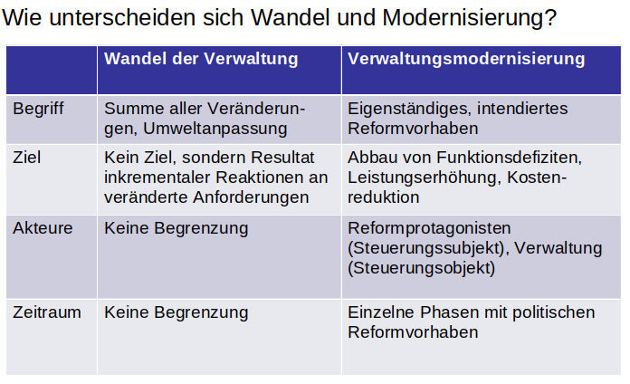

# 12.Sitzung: Wandel & Modernisierung der Verwaltung

Beispiel für Wandel:
- Vollzug europäischer Politik durch nationale Verwaltungen 
  - Beispiele: Auswirkung auf Steuerungsinstrumente, Umweltpolitik, Regionalförderung, Wettbewerb, Telekommunikation, Energie, Bahn

Beispiel für Modernisierung:
- E-Government Gesetz

Kommunen u.a. aufrgund hohen Reformdrucks -> Modernisierungsvorreiter, vollständige Übernahme des NSM

Länder mittlerer Reformdruck -> zweigeteiler Reformverlauf, selektive Übernahme

Bund geringer Reformdruck -> Nachzügler, selektive Übernahme

